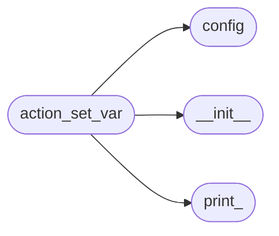
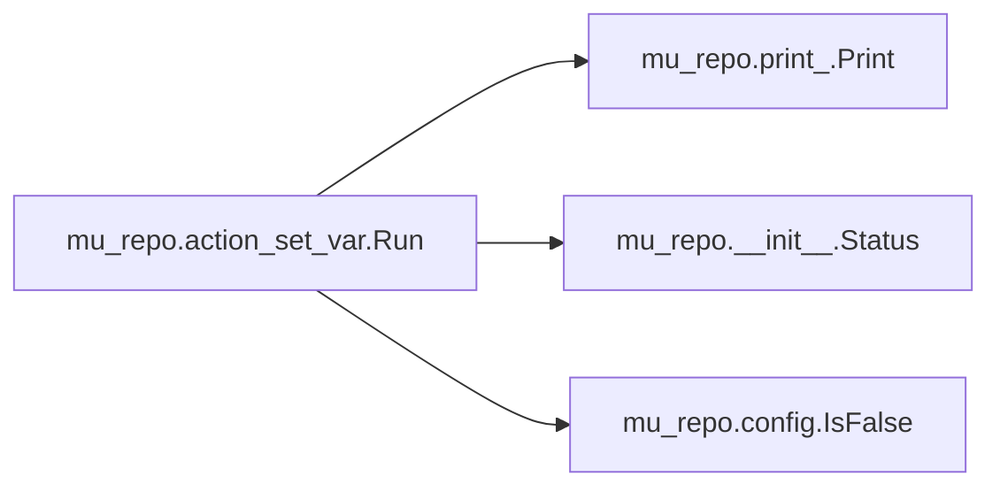

# Mu Repo Action Set Var

[_Documentation generated by Documatic_](https://www.documatic.com)

<!---Documatic-section-Codebase Structure-start--->
## Codebase Structure

<!---Documatic-block-system_architecture-start--->

<!---Documatic-block-system_architecture-end--->

# #
<!---Documatic-section-Codebase Structure-end--->

<!---Documatic-section-mu_repo.action_set_var.Run-start--->
## mu_repo.action_set_var.Run

<!---Documatic-section-Run-start--->


### Object Calls

* mu_repo.print_.Print
* mu_repo.__init__.Status
* mu_repo.config.IsFalse

<!---Documatic-block-mu_repo.action_set_var.Run-start--->
<details>
	<summary><code>mu_repo.action_set_var.Run</code> code snippet</summary>

```python
def Run(params):
    args = params.args
    if len(args) != 2 or args[1].count('=') != 1:
        msg = 'Syntax for set-var is "mu set-var key=value"'
        Print(msg)
        return Status(msg, True, params.config)
    (var, value) = args[1].split('=')
    var = var.strip().lower()
    if var == 'serial':
        if IsFalse(value):
            params.config.serial = False
        else:
            params.config.serial = True
    elif var == 'git':
        params.config.git = value
    else:
        msg = 'Variable to set: "%s" not recognized.' % (var,)
        Print(msg)
        return Status(msg, False, params.config)
    with open(params.config_file, 'w') as f:
        f.write(str(params.config))
    msg = 'Variable %s set to %s' % (var, value)
    Print(msg)
    return Status(msg, True, params.config)
```
</details>
<!---Documatic-block-mu_repo.action_set_var.Run-end--->
<!---Documatic-section-Run-end--->

# #
<!---Documatic-section-mu_repo.action_set_var.Run-end--->

[_Documentation generated by Documatic_](https://www.documatic.com)