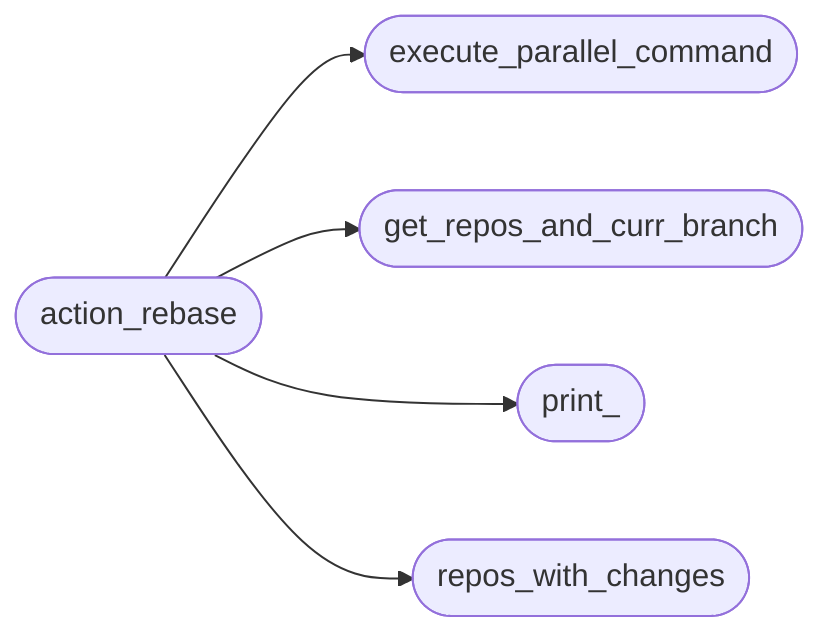
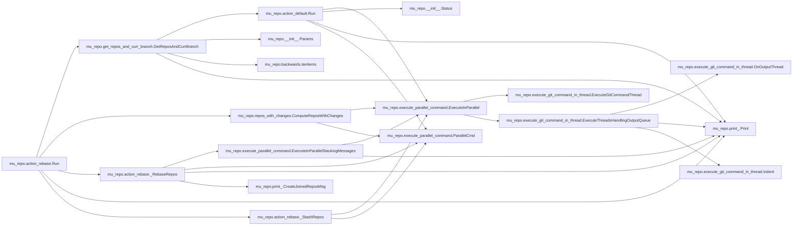
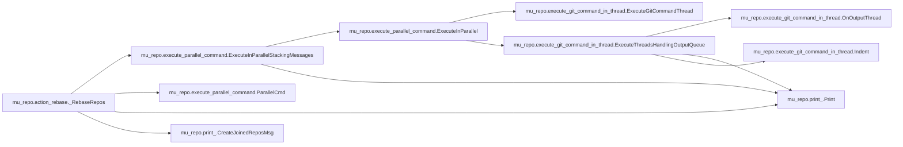
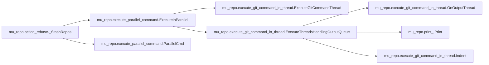

# Mu Repo Action Rebase

[_Documentation generated by Documatic_](https://www.documatic.com)

<!---Documatic-section-Codebase Structure-start--->
## Codebase Structure

<!---Documatic-block-system_architecture-start--->

<!---Documatic-block-system_architecture-end--->

# #
<!---Documatic-section-Codebase Structure-end--->

<!---Documatic-section-mu_repo.action_rebase.Run-start--->
## mu_repo.action_rebase.Run

<!---Documatic-section-Run-start--->


### Object Calls

* mu_repo.get_repos_and_curr_branch.GetReposAndCurrBranch
* mu_repo.repos_with_changes.ComputeReposWithChanges
* mu_repo.action_rebase._RebaseRepos
* mu_repo.print_.Print
* mu_repo.action_rebase._StashRepos

<!---Documatic-block-mu_repo.action_rebase.Run-start--->
<details>
	<summary><code>mu_repo.action_rebase.Run</code> code snippet</summary>

```python
def Run(params):
    repos_and_curr_branch = GetReposAndCurrBranch(params)
    repos_with_changes = ComputeReposWithChanges(repos_and_curr_branch, params)
    rebase_repos = []
    stash_rebase_repos = []
    for (repo, branch) in repos_and_curr_branch:
        if repos_with_changes[repo]:
            stash_rebase_repos.append((repo, branch))
        else:
            rebase_repos.append((repo, branch))
    if rebase_repos:
        _RebaseRepos(rebase_repos, params)
    if stash_rebase_repos:
        Print('\n  Repos with stash/rebase/unstash: ${START_COLOR}%s${RESET_COLOR}' % ' '.join((x[0] for x in stash_rebase_repos)))
        _StashRepos(stash_rebase_repos, params)
        _RebaseRepos(stash_rebase_repos, params)
        _StashRepos(stash_rebase_repos, params, pop=True)
    return repos_and_curr_branch
```
</details>
<!---Documatic-block-mu_repo.action_rebase.Run-end--->
<!---Documatic-section-Run-end--->

# #
<!---Documatic-section-mu_repo.action_rebase.Run-end--->

<!---Documatic-section-mu_repo.action_rebase._RebaseRepos-start--->
## mu_repo.action_rebase._RebaseRepos

<!---Documatic-section-_RebaseRepos-start--->


### Object Calls

* mu_repo.execute_parallel_command.ExecuteInParallelStackingMessages
* mu_repo.execute_parallel_command.ParallelCmd
* mu_repo.print_.Print
* mu_repo.print_.CreateJoinedReposMsg

<!---Documatic-block-mu_repo.action_rebase._RebaseRepos-start--->
<details>
	<summary><code>mu_repo.action_rebase._RebaseRepos</code> code snippet</summary>

```python
def _RebaseRepos(repos_and_branch, params):
    commands = []
    for (repo, branch) in repos_and_branch:
        commands.append(ParallelCmd(repo, [params.config.git, 'rebase', 'origin/%s' % (branch,)]))
    ExecuteInParallelStackingMessages(commands, lambda output: not output.stderr.strip() and output.stdout.strip().startswith('Current branch') and output.stdout.strip().endswith('is up to date.'), lambda repos: Print(CreateJoinedReposMsg('Up-to-date: ', repos)))
```
</details>
<!---Documatic-block-mu_repo.action_rebase._RebaseRepos-end--->
<!---Documatic-section-_RebaseRepos-end--->

# #
<!---Documatic-section-mu_repo.action_rebase._RebaseRepos-end--->

<!---Documatic-section-mu_repo.action_rebase._StashRepos-start--->
## mu_repo.action_rebase._StashRepos

<!---Documatic-section-_StashRepos-start--->


### Object Calls

* mu_repo.execute_parallel_command.ExecuteInParallel
* mu_repo.execute_parallel_command.ParallelCmd

<!---Documatic-block-mu_repo.action_rebase._StashRepos-start--->
<details>
	<summary><code>mu_repo.action_rebase._StashRepos</code> code snippet</summary>

```python
def _StashRepos(repos_and_branch, params, pop=False):
    commands = []
    for (repo, _branch) in repos_and_branch:
        if pop:
            cmd = [params.config.git, 'stash', 'pop']
        else:
            cmd = [params.config.git, 'stash', '-u']
        commands.append(ParallelCmd(repo, cmd))
    ExecuteInParallel(commands)
```
</details>
<!---Documatic-block-mu_repo.action_rebase._StashRepos-end--->
<!---Documatic-section-_StashRepos-end--->

# #
<!---Documatic-section-mu_repo.action_rebase._StashRepos-end--->

[_Documentation generated by Documatic_](https://www.documatic.com)