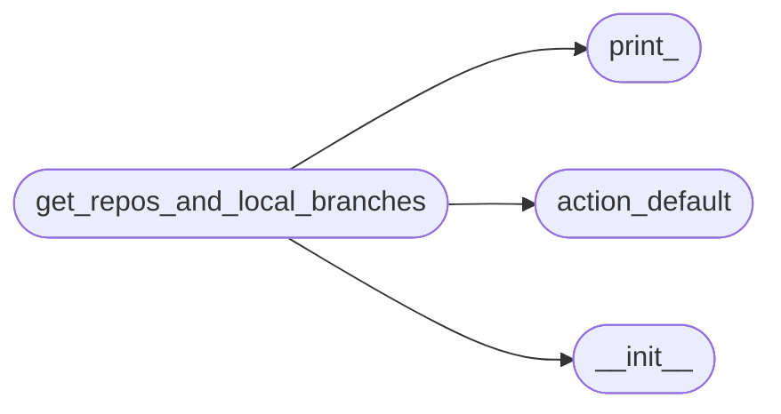
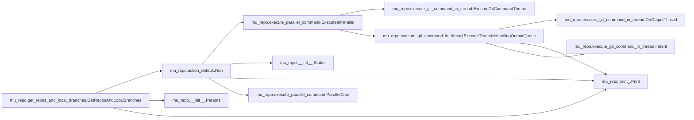

# Mu Repo Get Repos And Local Branches

[_Documentation generated by Documatic_](https://www.documatic.com)

<!---Documatic-section-Codebase Structure-start--->
## Codebase Structure

<!---Documatic-block-system_architecture-start--->

<!---Documatic-block-system_architecture-end--->

# #
<!---Documatic-section-Codebase Structure-end--->

<!---Documatic-section-mu_repo.get_repos_and_local_branches.GetReposAndLocalBranches-start--->
## mu_repo.get_repos_and_local_branches.GetReposAndLocalBranches

<!---Documatic-section-GetReposAndLocalBranches-start--->


### Object Calls

* mu_repo.action_default.Run
* mu_repo.__init__.Params
* mu_repo.print_.Print

<!---Documatic-block-mu_repo.get_repos_and_local_branches.GetReposAndLocalBranches-start--->
<details>
	<summary><code>mu_repo.get_repos_and_local_branches.GetReposAndLocalBranches</code> code snippet</summary>

```python
def GetReposAndLocalBranches(params, patterns=(), remote=False):
    repos_and_curr_branch = []

    def OnOutput(output):
        stdout = output.stdout.strip()
        if stdout:
            branches = set()
            for line in stdout.splitlines():
                branch = line.strip()
                if branch.startswith('*'):
                    branch = branch[1:].strip()
                if not patterns:
                    branches.add(branch)
                else:
                    for pat in patterns:
                        if fnmatch(branch, pat):
                            branches.add(branch)
            repos_and_curr_branch.append((output.repo, branches))
        else:
            Print('Unable to execute git branch for: %s' % (output.repo,))
    from .action_default import Run
    from mu_repo import Params
    old_serial = params.config.serial
    params.config.serial = False
    args = ['branch']
    if remote:
        args.append('-r')
    Run(Params(params.config, args, params.config_file), on_output=OnOutput)
    params.config.serial = old_serial
    return repos_and_curr_branch
```
</details>
<!---Documatic-block-mu_repo.get_repos_and_local_branches.GetReposAndLocalBranches-end--->
<!---Documatic-section-GetReposAndLocalBranches-end--->

# #
<!---Documatic-section-mu_repo.get_repos_and_local_branches.GetReposAndLocalBranches-end--->

[_Documentation generated by Documatic_](https://www.documatic.com)