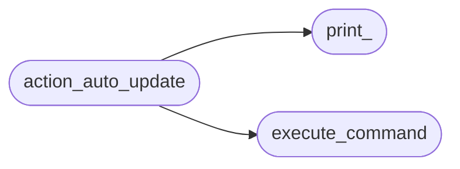
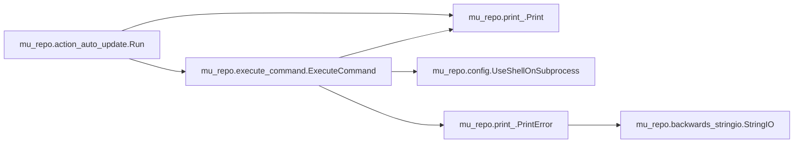

# Mu Repo Action Auto Update

[_Documentation generated by Documatic_](https://www.documatic.com)

<!---Documatic-section-Codebase Structure-start--->
## Codebase Structure

<!---Documatic-block-system_architecture-start--->

<!---Documatic-block-system_architecture-end--->

# #
<!---Documatic-section-Codebase Structure-end--->

<!---Documatic-section-mu_repo.action_auto_update.Run-start--->
## mu_repo.action_auto_update.Run

<!---Documatic-section-Run-start--->


### Object Calls

* mu_repo.execute_command.ExecuteCommand
* mu_repo.print_.Print

<!---Documatic-block-mu_repo.action_auto_update.Run-start--->
<details>
	<summary><code>mu_repo.action_auto_update.Run</code> code snippet</summary>

```python
def Run(params):
    import mu_repo
    import os.path
    repo_dir = os.path.dirname(os.path.dirname(mu_repo.__file__))
    if not os.path.exists(os.path.join(repo_dir, '.git')):
        Print('Can only automatically update mu-repo if it was properly gotten from a git repository (if it was installed with pip, use ${START_COLOR}pip install mu-repo --upgrade${RESET_COLOR}).')
        return
    config = params.config
    git = config.git or 'git'
    ExecuteCommand([git, 'pull', '--rebase'], repo=repo_dir)
```
</details>
<!---Documatic-block-mu_repo.action_auto_update.Run-end--->
<!---Documatic-section-Run-end--->

# #
<!---Documatic-section-mu_repo.action_auto_update.Run-end--->

[_Documentation generated by Documatic_](https://www.documatic.com)