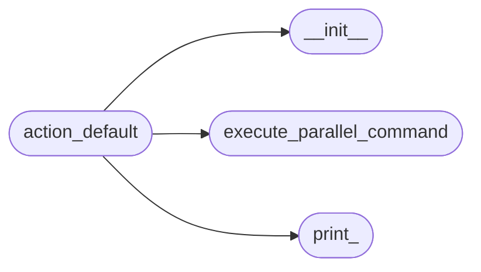
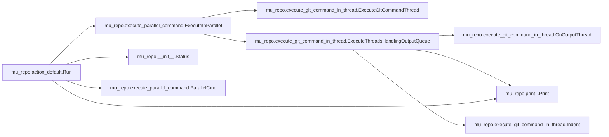

# Mu Repo Action Default

[_Documentation generated by Documatic_](https://www.documatic.com)

<!---Documatic-section-Codebase Structure-start--->
## Codebase Structure

<!---Documatic-block-system_architecture-start--->

<!---Documatic-block-system_architecture-end--->

# #
<!---Documatic-section-Codebase Structure-end--->

<!---Documatic-section-mu_repo.action_default.Run-start--->
## mu_repo.action_default.Run

<!---Documatic-section-Run-start--->


### Object Calls

* mu_repo.execute_parallel_command.ExecuteInParallel
* mu_repo.__init__.Status
* mu_repo.print_.Print
* mu_repo.execute_parallel_command.ParallelCmd

<!---Documatic-block-mu_repo.action_default.Run-start--->
<details>
	<summary><code>mu_repo.action_default.Run</code> code snippet</summary>

```python
def Run(params, on_output=None):
    args = params.args
    config = params.config
    if not config.is_sh_command:
        arg0 = args[0]
        if arg0 == 'st':
            args[0] = 'status'
            if len(args) == 1:
                args.insert(1, '-s')
        elif arg0 == 'co':
            args[0] = 'checkout'
        elif len(args) == 1:
            if arg0 == 'mu-branch':
                args[0] = 'rev-parse'
                args.insert(1, '--abbrev-ref')
                args.insert(2, 'HEAD')
    if not config.repos:
        msg = 'No repository registered. Use mu register repo_name to register repository.'
        Print(msg)
        return Status(msg, True, config)
    commands = []
    for repo in config.repos:
        if not os.path.exists(repo):
            Print('%s does not exist' % (repo,))
        else:
            commands.append(ParallelCmd(repo, [config.git] + args))
    ExecuteInParallel(commands, on_output, serial=config.serial)
    return Status('Finished', True)
```
</details>
<!---Documatic-block-mu_repo.action_default.Run-end--->
<!---Documatic-section-Run-end--->

# #
<!---Documatic-section-mu_repo.action_default.Run-end--->

[_Documentation generated by Documatic_](https://www.documatic.com)