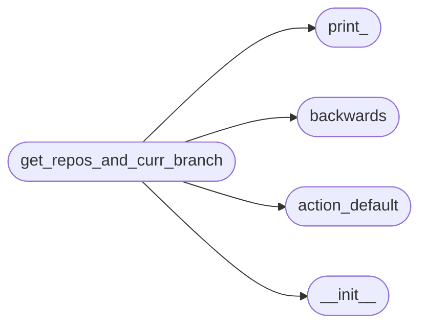
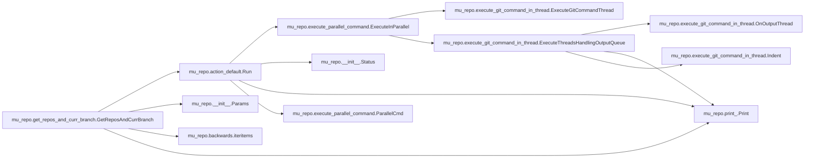

# Mu Repo Get Repos And Curr Branch

[_Documentation generated by Documatic_](https://www.documatic.com)

<!---Documatic-section-Codebase Structure-start--->
## Codebase Structure

<!---Documatic-block-system_architecture-start--->

<!---Documatic-block-system_architecture-end--->

# #
<!---Documatic-section-Codebase Structure-end--->

<!---Documatic-section-mu_repo.get_repos_and_curr_branch.GetReposAndCurrBranch-start--->
## mu_repo.get_repos_and_curr_branch.GetReposAndCurrBranch

<!---Documatic-section-GetReposAndCurrBranch-start--->


### Object Calls

* mu_repo.action_default.Run
* mu_repo.__init__.Params
* mu_repo.backwards.iteritems
* mu_repo.print_.Print

<!---Documatic-block-mu_repo.get_repos_and_curr_branch.GetReposAndCurrBranch-start--->
<details>
	<summary><code>mu_repo.get_repos_and_curr_branch.GetReposAndCurrBranch</code> code snippet</summary>

```python
def GetReposAndCurrBranch(params, verbose=True):
    repos_and_curr_branch = []

    def OnOutput(output):
        stdout = output.stdout.strip()
        if stdout:
            repos_and_curr_branch.append((output.repo, stdout))
        elif verbose:
            Print('Unable to update (could not get current branch for: %s)' % (output.repo,))
    from .action_default import Run
    from mu_repo import Params
    old_serial = params.config.serial
    params.config.serial = False
    Run(Params(params.config, ['rev-parse', '--abbrev-ref', 'HEAD'], params.config_file), on_output=OnOutput)
    if verbose:
        branch_to_repos = {}
        for (repo, branch) in repos_and_curr_branch:
            branch_to_repos.setdefault(branch, []).append(repo)
        for (branch, repos) in iteritems(branch_to_repos):
            Print('Will handle ${START_COLOR}origin %s${RESET_COLOR} for: %s\n' % (branch, ', '.join(sorted(repos))))
    params.config.serial = old_serial
    return repos_and_curr_branch
```
</details>
<!---Documatic-block-mu_repo.get_repos_and_curr_branch.GetReposAndCurrBranch-end--->
<!---Documatic-section-GetReposAndCurrBranch-end--->

# #
<!---Documatic-section-mu_repo.get_repos_and_curr_branch.GetReposAndCurrBranch-end--->

[_Documentation generated by Documatic_](https://www.documatic.com)