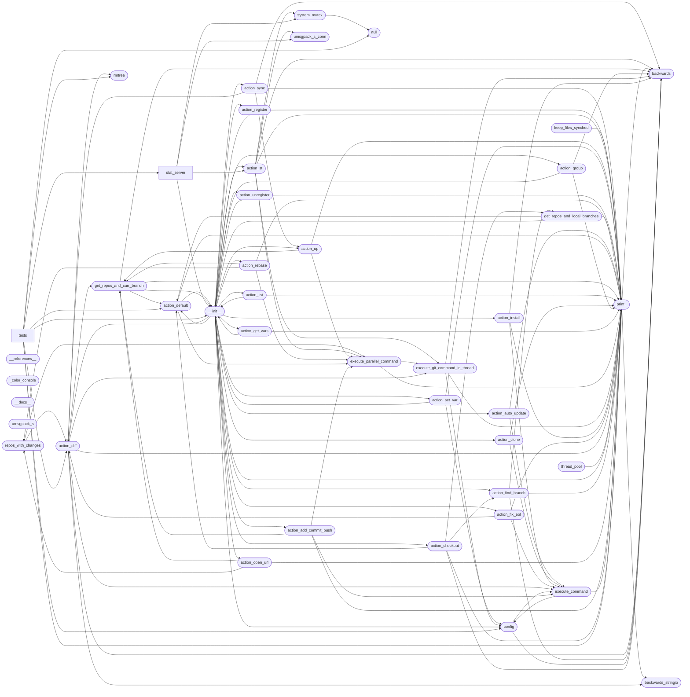

# Code Overview

[_Documentation generated by Documatic_](https://www.documatic.com)

<!---Documatic-section-Codebase Structure Python-start--->
## Codebase Structure Python

The codebase has a single-depth folder structure,
                with 54 code files in total.

<!---Documatic-block-system_architecture-start--->

<!---Documatic-block-system_architecture-end--->

# #
<!---Documatic-section-Codebase Structure Python-end--->

<!---Documatic-section-Key Infrastructure-start--->
## Key Infrastructure

### MongoDB is used in:

* `Print` of `mu_repo.print_`

# #
<!---Documatic-section-Key Infrastructure-end--->

<!---Documatic-section-Key Objects-start--->
## Key Objects

There are exposed imports at level-0
from the source directory (mu_repo)

<!---Documatic-block-mu_repo-start--->

	
<code>mu_repo</code> (Click to Expand!)

* `mu_repo.action_add_commit_push.Run`
* `mu_repo.action_add_commit_push.Run`
* `mu_repo.action_add_commit_push.Run`
* `mu_repo.action_add_commit_push.Run`
* `mu_repo.action_add_commit_push.Run`
* `mu_repo.action_auto_update.Run`
* `mu_repo.action_checkout.Run`
* `mu_repo.action_clone.Run`
* `mu_repo.action_default.Run`
* `mu_repo.action_default.Run`
* `mu_repo.action_diff.Run`
* `mu_repo.action_find_branch.Run`
* `mu_repo.action_fix_eol.Run`
* `mu_repo.action_get_vars.Run`
* `mu_repo.action_group.Run`
* `mu_repo.action_install.Run`
* `mu_repo.action_list.Run`
* `mu_repo.action_open_url.Run`
* `mu_repo.action_rebase.Run`
* `mu_repo.action_register.Run`
* `mu_repo.action_set_var.Run`
* `mu_repo.action_st.Run`
* `mu_repo.action_sync.Run`
* `mu_repo.action_unregister.Run`
* `mu_repo.action_up.Run`
* `mu_repo.config.Config`
* `mu_repo.print_.Print`

<!---Documatic-block-mu_repo-end--->

# #
<!---Documatic-section-Key Objects-end--->

<!---Documatic-section-Important Functions-start--->
## Important Functions

<!---Documatic-block-important_funcs-start--->
<!---Documatic-block-most_used_funcs-start--->
### Most Utilised Functions

* mu_repo.backwards.iteritems (7 times)
* mu_repo.backwards.raw_input (4 times)
* mu_repo.system_mutex.create_system_mutex_for_current_dir (3 times)
* mu_repo.tests.utils.configure_git_user (2 times)
* mu_repo.tests.utils.push_dir (2 times)
* mu_repo.stat_server.winapi.read_events (1 times)
* mu_repo.stat_server.winapi.get_directory_handle (1 times)
<!---Documatic-block-most_used_funcs-end--->

<!---Documatic-block-end_user_funcs-start--->
### End User Exposed Functions

* mu_repo.action_get_vars.Run
* mu_repo.action_set_var.Run
* mu_repo.action_clone.Run
* mu_repo.action_list.Run
* mu_repo.action_open_url.Run
* mu_repo.action_default.Run
* mu_repo.action_checkout.Run
* mu_repo.action_st.Run
* mu_repo.action_auto_update.Run
* mu_repo.action_rebase.Run
* mu_repo.action_register.Run
* mu_repo.action_group.Run
* mu_repo.action_fix_eol.Run
* mu_repo.action_unregister.Run
* mu_repo.action_add_commit_push.Run
* mu_repo.action_find_branch.Run
* mu_repo.action_sync.Run
* mu_repo.config.Config
* mu_repo.action_up.Run
* mu_repo.action_install.Run
* mu_repo.action_diff.Run
* mu_repo.print_.Print
* mu_repo.__init__.PrintTime
* mu_repo.__init__.CreateConfig
* mu_repo.__init__.CreateParams
* mu_repo.__init__.SearchConfigDir
* mu_repo.__init__.main
* mu_repo.__init__.main_entry_point
* mu_repo.__init__.Status
* mu_repo.__init__.Params
<!---Documatic-block-end_user_funcs-end--->
<!---Documatic-block-important_funcs-end--->

# #
<!---Documatic-section-Important Functions-end--->

<!---Documatic-section-File IO-start--->
## File IO

<!---Documatic-block-file_io-start--->
The following files have file read operations

<!---Documatic-block-mu_repo-start--->

	
<code>mu_repo</code> (Click to Expand!)

* mu_repo.__init__
* mu_repo.action_add_commit_push
* mu_repo.action_clone: http://fabioz.github.io/mu-repo/cloning/
* mu_repo.action_fix_eol
* mu_repo.action_st

<!---Documatic-block-mu_repo-end--->

<!---Documatic-block-mu_repo.stat_server-start--->

	
<code>mu_repo.stat_server</code> (Click to Expand!)

* mu_repo.stat_server.server

<!---Documatic-block-mu_repo.stat_server-end--->

<!---Documatic-block-mu_repo.tests-start--->

	
<code>mu_repo.tests</code> (Click to Expand!)

* mu_repo.tests.test_clone
* mu_repo.tests.test_diff_command
* mu_repo.tests.test_keep_files_synched

<!---Documatic-block-mu_repo.tests-end--->

The following files have file write operations

<!---Documatic-block-mu_repo-start--->

	
<code>mu_repo</code> (Click to Expand!)

* mu_repo.action_diff
* mu_repo.action_fix_eol
* mu_repo.action_group
* mu_repo.action_register
* mu_repo.action_set_var
* mu_repo.action_unregister
* mu_repo.system_mutex

<!---Documatic-block-mu_repo-end--->

<!---Documatic-block-mu_repo.tests-start--->

	
<code>mu_repo.tests</code> (Click to Expand!)

* mu_repo.tests.test_checkout
* mu_repo.tests.test_clone: ./test_temp_dir/remote/projectB/.mu_repo, ./test_temp_dir/remote/projectC/.mu_repo
* mu_repo.tests.test_diff_command
* mu_repo.tests.test_keep_files_synched
* mu_repo.tests.test_mu_repo

<!---Documatic-block-mu_repo.tests-end--->
<!---Documatic-block-file_io-end--->

# #
<!---Documatic-section-File IO-end--->

<!---Documatic-section-Class Hierarchy-start--->
## Class Hierarchy

<!---Documatic-block-Structure-start--->

	
<code>Structure</code> (Click to Expand!)

* mu_repo._color_console.CONSOLE_SCREEN_BUFFER_INFO
* mu_repo._color_console.COORD
* mu_repo._color_console.SMALL_RECT

<!---Documatic-block-Structure-end--->

<!---Documatic-block-mu_repo.execute_git_command_in_thread.ExecuteGitCommandThread-start--->

	
<code>mu_repo.execute_git_command_in_thread.ExecuteGitCommandThread</code> (Click to Expand!)

* mu_repo.action_diff.DoDiffOnRepoThread

<!---Documatic-block-mu_repo.execute_git_command_in_thread.ExecuteGitCommandThread-end--->

<!---Documatic-block-mu_repo.umsgpack_s_conn.ConnectionHandler-start--->

	
<code>mu_repo.umsgpack_s_conn.ConnectionHandler</code> (Click to Expand!)

* mu_repo.umsgpack_s_conn.EchoHandler

<!---Documatic-block-mu_repo.umsgpack_s_conn.ConnectionHandler-end--->

<!---Documatic-block-mu_repo.umsgpack_s_conn.UMsgPacker-start--->

	
<code>mu_repo.umsgpack_s_conn.UMsgPacker</code> (Click to Expand!)

* mu_repo.umsgpack_s_conn.Client
* mu_repo.umsgpack_s_conn.ConnectionHandler

<!---Documatic-block-mu_repo.umsgpack_s_conn.UMsgPacker-end--->

<!---Documatic-block-object-start--->

	
<code>object</code> (Click to Expand!)

* mu_repo.keep_files_synched._KeepInSyncStruct
* mu_repo.umsgpack_s_conn.Server
* mu_repo.umsgpack_s_conn.UMsgPacker

<!---Documatic-block-object-end--->

<!---Documatic-block-threading.Thread-start--->

	
<code>threading.Thread</code> (Click to Expand!)

* mu_repo.execute_git_command_in_thread.ExecuteGitCommandThread
* mu_repo.execute_git_command_in_thread.OnOutputThread
* mu_repo.keep_files_synched._KeepInSyncThread
* mu_repo.umsgpack_s_conn.ConnectionHandler

<!---Documatic-block-threading.Thread-end--->

# #
<!---Documatic-section-Class Hierarchy-end--->

[_Documentation generated by Documatic_](https://www.documatic.com)