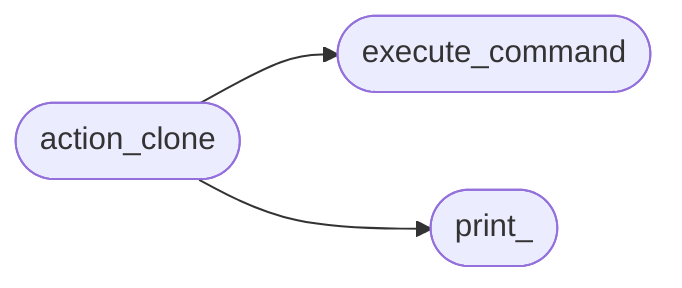
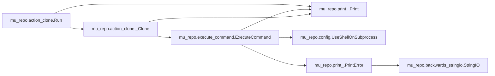
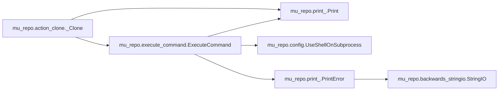

# Mu Repo Action Clone

[_Documentation generated by Documatic_](https://www.documatic.com)

<!---Documatic-section-Codebase Structure-start--->
## Codebase Structure

<!---Documatic-block-system_architecture-start--->

<!---Documatic-block-system_architecture-end--->

# #
<!---Documatic-section-Codebase Structure-end--->

<!---Documatic-section-mu_repo.action_clone.Run-start--->
## mu_repo.action_clone.Run

<!---Documatic-section-Run-start--->


### Object Calls

* mu_repo.print_.Print
* mu_repo.action_clone._Clone

<!---Documatic-block-mu_repo.action_clone.Run-start--->
<details>
	<summary><code>mu_repo.action_clone.Run</code> code snippet</summary>

```python
def Run(params):
    args = params.args
    assert args[0] == 'clone'
    args = args[1:]
    repos = []
    other_cmd_line_args = []
    if len(args) == 1 and args[0] == '--help':
        import webbrowser
        webbrowser.open('http://fabioz.github.io/mu-repo/cloning/')
        Print('Opening http://fabioz.github.io/mu-repo/cloning/ for help on cloning...')
        return
    elif len(args) == 1 and args[0] == '--all':
        Print('Cloning all registered repos...')
        repos = params.config.repos
    else:
        for arg in args:
            if not arg.startswith('-') and (not '@' in arg) and (not ':' in arg):
                repos.append(arg)
            else:
                other_cmd_line_args.append(arg)
    remote_hosts = params.config.remote_hosts
    if not repos:
        Print('Unable to clone because the repository name for cloning with mu was not detected.')
        return
    if not remote_hosts:
        Print('No mu-repo.remote-base-url specified for mu to work with.\nPlease specify the remote hosts for cloning with mu. i.e.:\n\ngit config --global --add mu-repo.remote-base-url ssh://git@github.com:myuser')
        return
    Print('Working with remote hosts:')
    for host in remote_hosts:
        Print('    %s' % host)
    Print('')
    import mu_repo
    for repo in repos:
        for remote in remote_hosts:
            if _Clone(remote, repo, params, other_cmd_line_args):
                created_dir = os.path.join('.', repo)
                new_mu_repo = os.path.join(created_dir, '.mu_repo')
                if os.path.exists(new_mu_repo):
                    with open(os.path.join(new_mu_repo), 'r') as stream:
                        mu_config = mu_repo.Config.Create(stream.read())
                    for new_repo in mu_config.repos:
                        if new_repo in ('.', './', '.\\'):
                            continue
                        if not new_repo.startswith('../') and (not new_repo.startswith('..\\')):
                            Print('Cannot clone: ${START_COLOR}%s${RESET_COLOR} (currently only works with relative repositories matching: ../name or ..\\name)' % (new_repo,))
                        else:
                            new_repo_name = new_repo[3:]
                            if new_repo_name and new_repo_name[0] not in ('.', '/', '\\'):
                                for remote in remote_hosts:
                                    if _Clone(remote, new_repo_name, params, other_cmd_line_args):
                                        break
                            else:
                                Print('Cannot clone: ${START_COLOR}%s${RESET_COLOR} (currently only works with relative repositories matching: ../name or ..\\name)' % (new_repo,))
                break
```
</details>
<!---Documatic-block-mu_repo.action_clone.Run-end--->
<!---Documatic-section-Run-end--->

# #
<!---Documatic-section-mu_repo.action_clone.Run-end--->

<!---Documatic-section-mu_repo.action_clone._Clone-start--->
## mu_repo.action_clone._Clone

<!---Documatic-section-_Clone-start--->


### Object Calls

* mu_repo.execute_command.ExecuteCommand
* mu_repo.print_.Print

<!---Documatic-block-mu_repo.action_clone._Clone-start--->
<details>
	<summary><code>mu_repo.action_clone._Clone</code> code snippet</summary>

```python
def _Clone(remote, repo, params, other_cmd_line_args):
    created_dir = os.path.join('.', repo)
    if os.path.exists(os.path.join(created_dir, '.git')):
        Print('Skipping clone of: ${START_COLOR}%s${RESET_COLOR} because it already exists.' % (repo,))
        return True
    remote_path = remote
    if not remote_path.endswith('/') and (not remote_path.endswith('\\')):
        remote_path += '/'
    git = params.config.git
    ExecuteCommand([git, 'clone', '%s%s' % (remote_path, repo)] + other_cmd_line_args, '.')
    if os.path.exists(os.path.join(created_dir, '.git')):
        return True
    return False
```
</details>
<!---Documatic-block-mu_repo.action_clone._Clone-end--->
<!---Documatic-section-_Clone-end--->

# #
<!---Documatic-section-mu_repo.action_clone._Clone-end--->

[_Documentation generated by Documatic_](https://www.documatic.com)