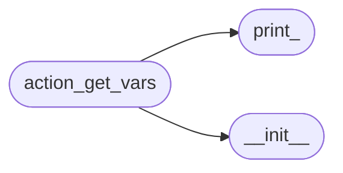
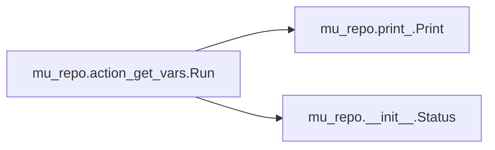

# Mu Repo Action Get Vars

[_Documentation generated by Documatic_](https://www.documatic.com)

<!---Documatic-section-Codebase Structure-start--->
## Codebase Structure

<!---Documatic-block-system_architecture-start--->

<!---Documatic-block-system_architecture-end--->

# #
<!---Documatic-section-Codebase Structure-end--->

<!---Documatic-section-mu_repo.action_get_vars.Run-start--->
## mu_repo.action_get_vars.Run

<!---Documatic-section-Run-start--->


### Object Calls

* mu_repo.print_.Print
* mu_repo.__init__.Status

<!---Documatic-block-mu_repo.action_get_vars.Run-start--->
<details>
	<summary><code>mu_repo.action_get_vars.Run</code> code snippet</summary>

```python
def Run(params):
    msg = str(params.config)
    Print(msg)
    return Status(msg, True, params.config)
```
</details>
<!---Documatic-block-mu_repo.action_get_vars.Run-end--->
<!---Documatic-section-Run-end--->

# #
<!---Documatic-section-mu_repo.action_get_vars.Run-end--->

[_Documentation generated by Documatic_](https://www.documatic.com)