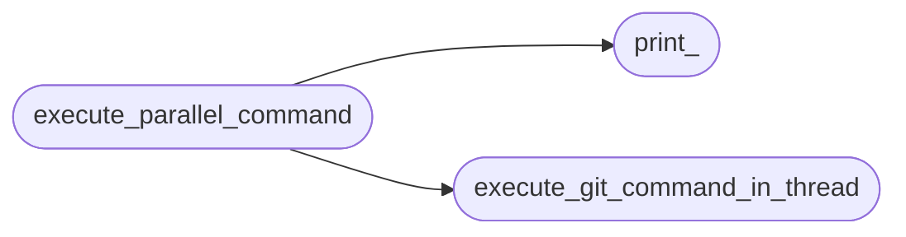
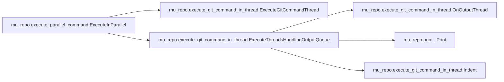
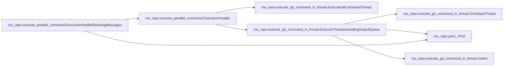

# Mu Repo Execute Parallel Command

[_Documentation generated by Documatic_](https://www.documatic.com)

<!---Documatic-section-Codebase Structure-start--->
## Codebase Structure

<!---Documatic-block-system_architecture-start--->

<!---Documatic-block-system_architecture-end--->

# #
<!---Documatic-section-Codebase Structure-end--->

<!---Documatic-section-mu_repo.execute_parallel_command.ExecuteInParallel-start--->
## mu_repo.execute_parallel_command.ExecuteInParallel

<!---Documatic-section-ExecuteInParallel-start--->


### Object Calls

* mu_repo.execute_git_command_in_thread.ExecuteGitCommandThread
* mu_repo.execute_git_command_in_thread.ExecuteThreadsHandlingOutputQueue

<!---Documatic-block-mu_repo.execute_parallel_command.ExecuteInParallel-start--->
<details>
	<summary><code>mu_repo.execute_parallel_command.ExecuteInParallel</code> code snippet</summary>

```python
def ExecuteInParallel(commands, on_output=None, serial=False):
    from mu_repo.execute_git_command_in_thread import ExecuteGitCommandThread
    try:
        import Queue
    except ImportError:
        import queue as Queue
    threads = []
    output_queue = Queue.Queue()
    for cmd in commands:
        t = ExecuteGitCommandThread(cmd.repo, cmd.cmd, output_queue)
        threads.append(t)
    if serial:
        for t in threads:
            t.run(serial=True)
    else:
        from mu_repo.execute_git_command_in_thread import ExecuteThreadsHandlingOutputQueue
        ExecuteThreadsHandlingOutputQueue(threads, output_queue, on_output=on_output)
```
</details>
<!---Documatic-block-mu_repo.execute_parallel_command.ExecuteInParallel-end--->
<!---Documatic-section-ExecuteInParallel-end--->

# #
<!---Documatic-section-mu_repo.execute_parallel_command.ExecuteInParallel-end--->

<!---Documatic-section-mu_repo.execute_parallel_command.ParallelCmd-start--->
## mu_repo.execute_parallel_command.ParallelCmd

<!---Documatic-section-ParallelCmd-start--->
<!---Documatic-block-mu_repo.execute_parallel_command.ParallelCmd-start--->
<details>
	<summary><code>mu_repo.execute_parallel_command.ParallelCmd</code> code snippet</summary>

```python
class ParallelCmd(object):
    __slots__ = ['cmd', 'repo']

    def __init__(self, repo, cmd):
        self.cmd = cmd
        self.repo = repo
```
</details>
<!---Documatic-block-mu_repo.execute_parallel_command.ParallelCmd-end--->
<!---Documatic-section-ParallelCmd-end--->

# #
<!---Documatic-section-mu_repo.execute_parallel_command.ParallelCmd-end--->

<!---Documatic-section-mu_repo.execute_parallel_command.ExecuteInParallelStackingMessages-start--->
## mu_repo.execute_parallel_command.ExecuteInParallelStackingMessages

<!---Documatic-section-ExecuteInParallelStackingMessages-start--->


### Object Calls

* mu_repo.execute_parallel_command.ExecuteInParallel
* mu_repo.print_.Print

<!---Documatic-block-mu_repo.execute_parallel_command.ExecuteInParallelStackingMessages-start--->
<details>
	<summary><code>mu_repo.execute_parallel_command.ExecuteInParallelStackingMessages</code> code snippet</summary>

```python
def ExecuteInParallelStackingMessages(commands, match_empty_output, execute_on_repos, serial=False):
    from .print_ import Print
    repos = []

    def on_output(output):
        if match_empty_output(output):
            repos.append(output.repo)
            return
        Print(output)
    ExecuteInParallel(commands, on_output=on_output, serial=serial)
    if repos:
        execute_on_repos(repos)
    return repos
```
</details>
<!---Documatic-block-mu_repo.execute_parallel_command.ExecuteInParallelStackingMessages-end--->
<!---Documatic-section-ExecuteInParallelStackingMessages-end--->

# #
<!---Documatic-section-mu_repo.execute_parallel_command.ExecuteInParallelStackingMessages-end--->

[_Documentation generated by Documatic_](https://www.documatic.com)