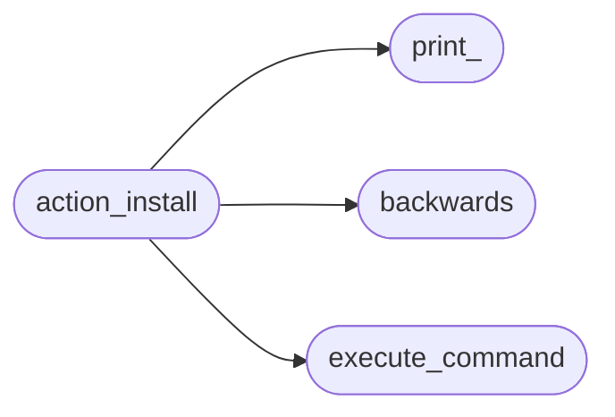
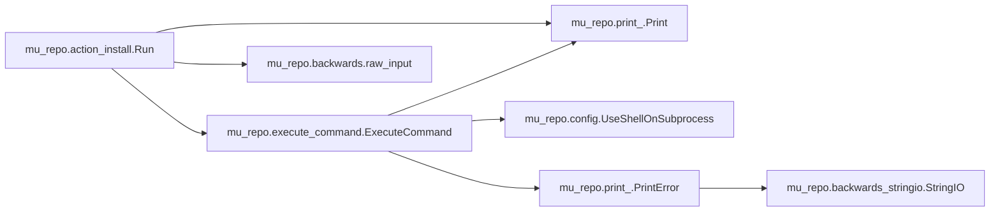

# Mu Repo Action Install

[_Documentation generated by Documatic_](https://www.documatic.com)

<!---Documatic-section-Codebase Structure-start--->
## Codebase Structure

<!---Documatic-block-system_architecture-start--->

<!---Documatic-block-system_architecture-end--->

# #
<!---Documatic-section-Codebase Structure-end--->

<!---Documatic-section-mu_repo.action_install.Run-start--->
## mu_repo.action_install.Run

<!---Documatic-section-Run-start--->


### Object Calls

* mu_repo.execute_command.ExecuteCommand
* mu_repo.print_.Print
* mu_repo.backwards.raw_input

<!---Documatic-block-mu_repo.action_install.Run-start--->
<details>
	<summary><code>mu_repo.action_install.Run</code> code snippet</summary>

```python
def Run(params):
    git = params.config.git or 'git'
    from mu_repo.execute_command import ExecuteCommand
    user_name = raw_input('User name:').strip()
    if user_name:
        ExecuteCommand([git] + 'config --global user.name'.split() + [user_name], '.')
    else:
        Print('Skipping user.name configuration.')
    user_email = raw_input('\nUser e-mail:').strip()
    if user_email:
        ExecuteCommand([git] + 'config --global user.email'.split() + [user_email], '.')
    else:
        Print('Skipping user.email configuration.')
    auto_crlf = raw_input('\nAuto-crlf handling (default false, options: false, true, input):').strip().lower()
    if not auto_crlf:
        auto_crlf = 'false'
    if auto_crlf in ('false', 'true', 'input'):
        ExecuteCommand([git] + 'config --global core.autocrlf'.split() + [auto_crlf], '.')
    else:
        Print('Skipping core.autocrlf configuration (input: "%s" not recognized).' % (auto_crlf,))
    config_date = raw_input('\nConfig format.pretty for one line and set default to short? (default: y, options: y, n)').strip().lower()
    if not config_date:
        config_date = 'y'
    if config_date == 'y':
        ExecuteCommand([git] + ['config', '--global', 'format.pretty', '%h %ad %Cgreen%aN%Creset %s'], '.')
        ExecuteCommand([git] + 'config --global log.date short'.split(), '.')
    wrap = raw_input('\nShow logs wrapped? (i.e.: set less -r): (default: y, options: y, n)').strip().lower()
    if not wrap:
        wrap = 'y'
    if wrap == 'y':
        ExecuteCommand([git, 'config', '--global', 'core.pager', 'less -r'], '.')
    wrap = raw_input('\nCreate "git st" and "git create-branch" aliases? (default: y, options: y, n)').strip().lower()
    if not wrap:
        wrap = 'y'
    if wrap == 'y':
        ExecuteCommand([git, 'config', '--global', 'alias.st', 'status -s'], '.')
        ExecuteCommand([git, 'config', '--global', 'alias.create-branch', 'checkout -b    '], '.')
```
</details>
<!---Documatic-block-mu_repo.action_install.Run-end--->
<!---Documatic-section-Run-end--->

# #
<!---Documatic-section-mu_repo.action_install.Run-end--->

[_Documentation generated by Documatic_](https://www.documatic.com)