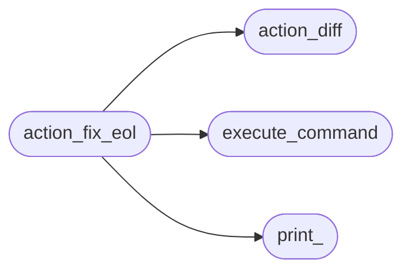

# Mu Repo Action Fix Eol

[_Documentation generated by Documatic_](https://www.documatic.com)

<!---Documatic-section-Codebase Structure-start--->
## Codebase Structure

<!---Documatic-block-system_architecture-start--->

<!---Documatic-block-system_architecture-end--->

# #
<!---Documatic-section-Codebase Structure-end--->

<!---Documatic-section-mu_repo.action_fix_eol.Run-start--->
## mu_repo.action_fix_eol.Run

<!---Documatic-section-Run-start--->


### Object Calls

* mu_repo.execute_command.ExecuteGettingStdOutput
* mu_repo.action_diff.ParsePorcelain
* mu_repo.action_fix_eol.Fix

<!---Documatic-block-mu_repo.action_fix_eol.Run-start--->
<details>
	<summary><code>mu_repo.action_fix_eol.Run</code> code snippet</summary>

```python
def Run(params):
    config = params.config
    for repo in config.repos:
        stdout = ExecuteGettingStdOutput([config.git or 'git'] + 'status --porcelain -z'.split(), repo)
        if sys.version_info[0] >= 3:
            stdout = stdout.decode(sys.getfilesystemencoding())
        for entry in ParsePorcelain(stdout):
            Fix(repo, entry.filename)
```
</details>
<!---Documatic-block-mu_repo.action_fix_eol.Run-end--->
<!---Documatic-section-Run-end--->

# #
<!---Documatic-section-mu_repo.action_fix_eol.Run-end--->

<!---Documatic-section-mu_repo.action_fix_eol.Fix-start--->
## mu_repo.action_fix_eol.Fix

<!---Documatic-section-Fix-start--->


### Object Calls

* mu_repo.print_.Print

<!---Documatic-block-mu_repo.action_fix_eol.Fix-start--->
<details>
	<summary><code>mu_repo.action_fix_eol.Fix</code> code snippet</summary>

```python
def Fix(root, filename):
    path = os.path.join(root, filename)
    if not os.path.exists(path):
        Print('Skip removed file:', path)
        return
    contents = open(path, 'rb').read()
    if b'\r' in contents:
        Print('Fixing:', path)
        contents = contents.replace(b'\r\n', b'\n').replace(b'\r', b'\n')
        open(path, 'wb').write(contents)
```
</details>
<!---Documatic-block-mu_repo.action_fix_eol.Fix-end--->
<!---Documatic-section-Fix-end--->

# #
<!---Documatic-section-mu_repo.action_fix_eol.Fix-end--->

[_Documentation generated by Documatic_](https://www.documatic.com)