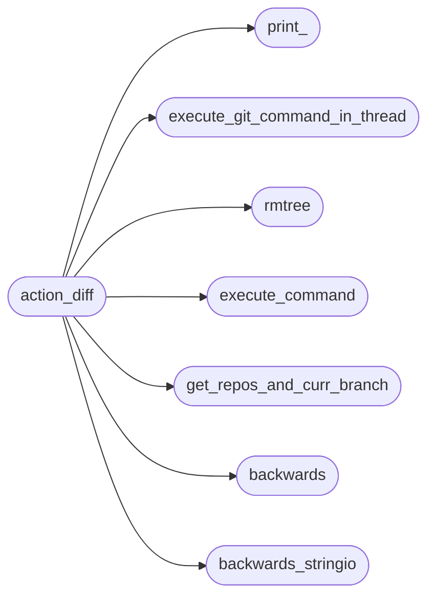
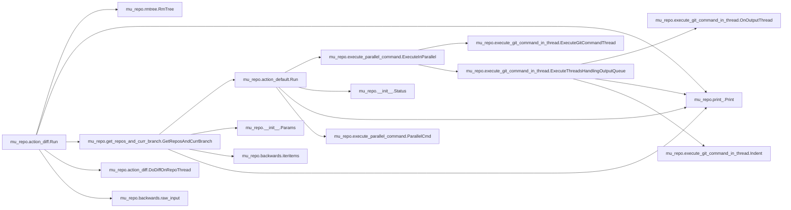
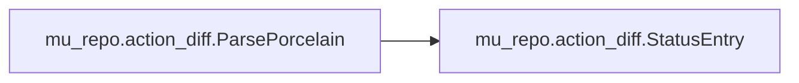

# Mu Repo Action Diff

[_Documentation generated by Documatic_](https://www.documatic.com)

<!---Documatic-section-Codebase Structure-start--->
## Codebase Structure

<!---Documatic-block-system_architecture-start--->

<!---Documatic-block-system_architecture-end--->

# #
<!---Documatic-section-Codebase Structure-end--->

<!---Documatic-section-mu_repo.action_diff.Run-start--->
## mu_repo.action_diff.Run

<!---Documatic-section-Run-start--->


### Object Calls

* mu_repo.rmtree.RmTree
* mu_repo.print_.Print
* mu_repo.get_repos_and_curr_branch.GetReposAndCurrBranch
* mu_repo.action_diff.DoDiffOnRepoThread
* mu_repo.backwards.raw_input

<!---Documatic-block-mu_repo.action_diff.Run-start--->
<details>
	<summary><code>mu_repo.action_diff.Run</code> code snippet</summary>

```python
def Run(params):
    config = params.config
    join = os.path.join
    temp_dir_name = '.mu.diff.git.tmp'
    if os.path.exists(temp_dir_name):
        n = ''
        while n not in ('y', 'n'):
            n = raw_input('Temporary dir for diff: %s already exists. Delete and continue (y) or cancel (n)? ' % (temp_dir_name,)).strip().lower()
            if n == 'y':
                RmTree(temp_dir_name)
                break
            if n == 'n':
                Print('Canceling diff action.')
                return
    temp_working = join(temp_dir_name, 'WORKING')
    temp_repo = join(temp_dir_name, 'REPO')
    os.mkdir(temp_dir_name)
    os.mkdir(temp_working)
    os.mkdir(temp_repo)
    from mu_repo import keep_files_synched

    def symlink(src, target):
        if os.path.isdir(src):
            if os.path.exists(target):
                os.rmdir(target)
            shutil.copytree(src, target)
            keep_files_synched.KeepInSync(src, target)
        else:
            if os.path.exists(target):
                if os.path.isdir(target):
                    RmTree(target)
                else:
                    os.remove(target)
            shutil.copyfile(src, target)
            keep_files_synched.KeepInSync(src, target)
    try:
        args = params.args
        branch = ''
        repos_and_curr_branch = None
        if len(args) > 1:
            branch = args[1]
            if branch == '--prev':
                repos_and_curr_branch = dict(GetReposAndCurrBranch(params, verbose=False))
        threads = []
        for repo in config.repos:
            if repos_and_curr_branch is not None:
                branch = repos_and_curr_branch[repo] + '@{1}'
                thread = DoDiffOnRepoThread(config, repo, symlink, temp_working, temp_repo, branch)
            else:
                thread = DoDiffOnRepoThread(config, repo, symlink, temp_working, temp_repo, branch)
            threads.append(thread)
            thread.start()
        for thread in threads:
            thread.join()
        thread_pool.Join()
        for thread in threads:
            if thread.entry_count != 0:
                break
        else:
            Print('No changes found.')
            return
        if sys.platform == 'win32':
            write_left = ['/wl']
            if not branch:
                write_left = []
            winmerge_cmd = 'WinMergeU.exe /r /u /wr /dl WORKINGCOPY /dr HEAD'.split()
            cmd = winmerge_cmd + write_left + [temp_working, temp_repo]
            try:
                subprocess.call(cmd)
            except:
                Print('Error calling: %s' % (' '.join(cmd),))
        else:
            cmd = ['meld', temp_working, temp_repo]
            try:
                subprocess.call(cmd)
            except:
                Print('Error calling: %s' % (' '.join(cmd),))
    finally:
        if keep_files_synched is not None:
            keep_files_synched.StopSyncs()

        def onerror(*args):
            Print('Error removing temporary directory structure: %s' % (args,))
        RmTree(temp_dir_name, onerror=onerror)
```
</details>
<!---Documatic-block-mu_repo.action_diff.Run-end--->
<!---Documatic-section-Run-end--->

# #
<!---Documatic-section-mu_repo.action_diff.Run-end--->

<!---Documatic-section-mu_repo.action_diff.ParsePorcelain-start--->
## mu_repo.action_diff.ParsePorcelain

<!---Documatic-section-ParsePorcelain-start--->


### Object Calls

* mu_repo.action_diff.StatusEntry

<!---Documatic-block-mu_repo.action_diff.ParsePorcelain-start--->
<details>
	<summary><code>mu_repo.action_diff.ParsePorcelain</code> code snippet</summary>

```python
def ParsePorcelain(porcelain_output, only_split=False):
    it = iter(porcelain_output.split('\x00'))
    for entry in it:
        entry = entry.strip()
        if not entry:
            continue
        for (i, c) in enumerate(entry):
            if c == ' ':
                break
        if only_split:
            yield StatusEntry(entry, entry)
        else:
            st = entry[:i].strip()
            entry = entry[i:].strip()
            if not st:
                continue
            if 'R' in st:
                filename_from = next(it)
                yield StatusEntry(entry, filename_from)
            else:
                yield StatusEntry(entry, entry)
```
</details>
<!---Documatic-block-mu_repo.action_diff.ParsePorcelain-end--->
<!---Documatic-section-ParsePorcelain-end--->

# #
<!---Documatic-section-mu_repo.action_diff.ParsePorcelain-end--->

<!---Documatic-section-mu_repo.action_diff.DoDiffOnRepoThread-start--->
## mu_repo.action_diff.DoDiffOnRepoThread

<!---Documatic-section-DoDiffOnRepoThread-start--->
<!---Documatic-block-mu_repo.action_diff.DoDiffOnRepoThread-start--->
<details>
	<summary><code>mu_repo.action_diff.DoDiffOnRepoThread</code> code snippet</summary>

```python
class DoDiffOnRepoThread(ExecuteGitCommandThread):

    def __init__(self, config, repo, symlink, temp_working, temp_repo, branch):
        self.symlink = symlink
        self.temp_working = temp_working
        self.temp_repo = temp_repo
        self.branch = branch
        self.config = config
        if not branch:
            args = 'status --porcelain -z'.split()
        else:
            args = 'diff --name-only -z HEAD'.split() + [branch]
        self.entry_count = 0
        ExecuteGitCommandThread.__init__(self, repo, [config.git] + args, output_queue=DummyQueue())

    def run(self):
        try:
            ExecuteGitCommandThread.run(self, serial=False)
        except:
            NotifyErrorListeners()

    def _HandleOutput(self, msg, stdout, stderr):
        (temp_working, temp_repo, repo) = (self.temp_working, self.temp_repo, self.repo)
        initial_repo = repo
        while repo.startswith('..'):
            repo = repo[1:]
        for entry in ParsePorcelain(stdout, only_split=self.branch != ''):
            self.entry_count += 1
            (original, link, original_repo, target_repo, filename) = entry.MakeDirs(temp_working, temp_repo, repo, initial_repo)
            if not self.branch:
                if not os.path.exists(original):
                    with open(link, 'w') as f:
                        f.write('File: %s was removed in working dir.' % (original,))
                else:
                    thread_pool.AddTask(Symlink(self.symlink, original, link))
                thread_pool.AddTask(CreateFromGit(self.config.git or 'git', self.repo, original_repo, target_repo, 'HEAD'))
            else:
                original = '/'.join(original.replace('\\', '/').split('/')[1:])
                thread_pool.AddTask(CreateFromGit(self.config.git or 'git', self.repo, filename, target_repo, self.branch))
                thread_pool.AddTask(CreateFromGit(self.config.git or 'git', self.repo, original_repo, link, 'HEAD'))
```
</details>
<!---Documatic-block-mu_repo.action_diff.DoDiffOnRepoThread-end--->
<!---Documatic-section-DoDiffOnRepoThread-end--->

# #
<!---Documatic-section-mu_repo.action_diff.DoDiffOnRepoThread-end--->

[_Documentation generated by Documatic_](https://www.documatic.com)