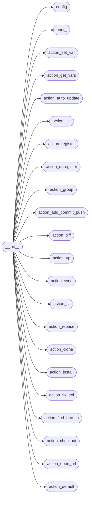
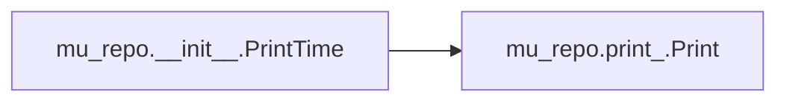
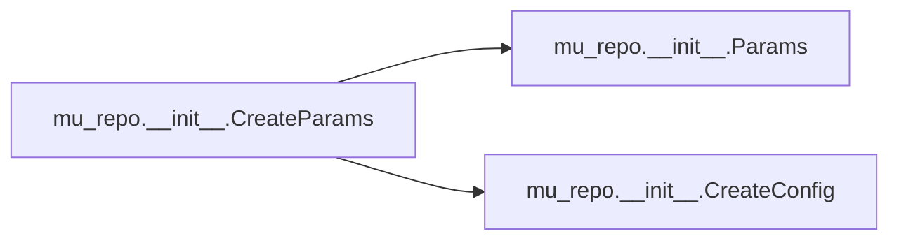
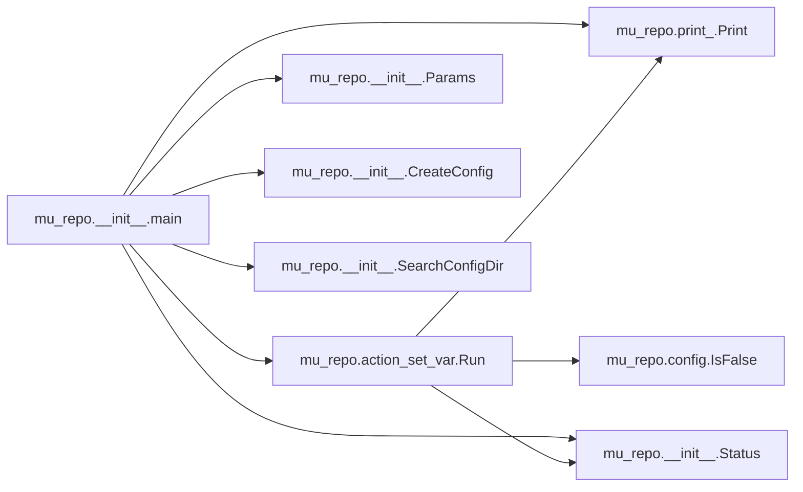
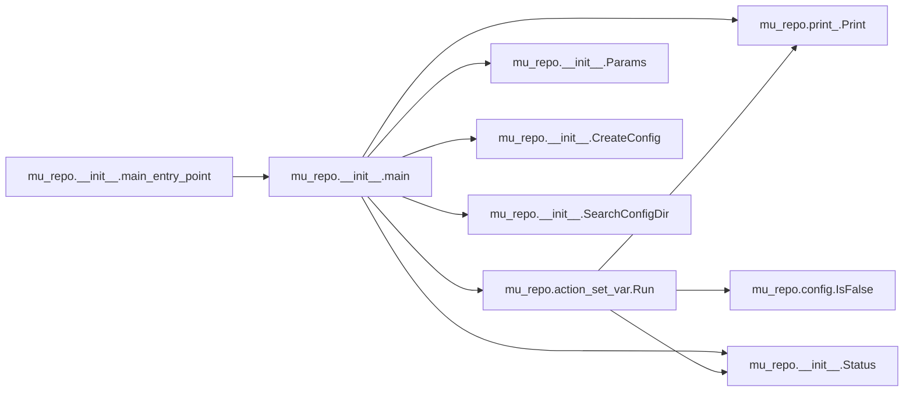

# Mu Repo Init

[_Documentation generated by Documatic_](https://www.documatic.com)

<!---Documatic-section-Codebase Structure-start--->
## Codebase Structure

<!---Documatic-block-system_architecture-start--->

<!---Documatic-block-system_architecture-end--->

# #
<!---Documatic-section-Codebase Structure-end--->

<!---Documatic-section-mu_repo.__init__.PrintTime-start--->
## mu_repo.__init__.PrintTime

<!---Documatic-section-PrintTime-start--->


### Object Calls

* mu_repo.print_.Print

<!---Documatic-block-mu_repo.__init__.PrintTime-start--->
<details>
	<summary><code>mu_repo.__init__.PrintTime</code> code snippet</summary>

```python
def PrintTime(func):
    import time

    def Exec(*args, **kwargs):
        curr_time = time.time()
        ret = func(*args, **kwargs)
        diff = time.time() - curr_time
        Print('Total time: %.2fs' % (diff,))
        return ret
    return Exec
```
</details>
<!---Documatic-block-mu_repo.__init__.PrintTime-end--->
<!---Documatic-section-PrintTime-end--->

# #
<!---Documatic-section-mu_repo.__init__.PrintTime-end--->

<!---Documatic-section-mu_repo.__init__.CreateConfig-start--->
## mu_repo.__init__.CreateConfig

<!---Documatic-section-CreateConfig-start--->
<!---Documatic-block-mu_repo.__init__.CreateConfig-start--->
<details>
	<summary><code>mu_repo.__init__.CreateConfig</code> code snippet</summary>

```python
def CreateConfig(config_file='.mu_repo'):
    if config_file is None:
        contents = ''
    else:
        exists = os.path.exists(config_file)
        if not exists:
            contents = ''
        else:
            with open(config_file, 'r') as f:
                contents = f.read()
    return Config.Create(contents)
```
</details>
<!---Documatic-block-mu_repo.__init__.CreateConfig-end--->
<!---Documatic-section-CreateConfig-end--->

# #
<!---Documatic-section-mu_repo.__init__.CreateConfig-end--->

<!---Documatic-section-mu_repo.__init__.CreateParams-start--->
## mu_repo.__init__.CreateParams

<!---Documatic-section-CreateParams-start--->


### Object Calls

* mu_repo.__init__.Params
* mu_repo.__init__.CreateConfig

<!---Documatic-block-mu_repo.__init__.CreateParams-start--->
<details>
	<summary><code>mu_repo.__init__.CreateParams</code> code snippet</summary>

```python
def CreateParams(args, config_file='.mu_repo'):
    return Params(CreateConfig(config_file), args, config_file)
```
</details>
<!---Documatic-block-mu_repo.__init__.CreateParams-end--->
<!---Documatic-section-CreateParams-end--->

# #
<!---Documatic-section-mu_repo.__init__.CreateParams-end--->

<!---Documatic-section-mu_repo.__init__.SearchConfigDir-start--->
## mu_repo.__init__.SearchConfigDir

<!---Documatic-section-SearchConfigDir-start--->
<!---Documatic-block-mu_repo.__init__.SearchConfigDir-start--->
<details>
	<summary><code>mu_repo.__init__.SearchConfigDir</code> code snippet</summary>

```python
def SearchConfigDir(start_dir, name='.mu_repo', recurse_limit=20):
    start_dir = os.path.abspath(start_dir)
    while recurse_limit >= 0:
        filename = os.path.join(start_dir, name)
        if os.path.isfile(filename):
            return start_dir
        if os.path.isdir(os.path.join(start_dir, '.git')):
            return start_dir
        parent_dir = os.path.dirname(start_dir)
        if parent_dir == start_dir:
            return None
        start_dir = parent_dir
        recurse_limit -= 1
    return None
```
</details>
<!---Documatic-block-mu_repo.__init__.SearchConfigDir-end--->
<!---Documatic-section-SearchConfigDir-end--->

# #
<!---Documatic-section-mu_repo.__init__.SearchConfigDir-end--->

<!---Documatic-section-mu_repo.__init__.main-start--->
## mu_repo.__init__.main

<!---Documatic-section-main-start--->


### Object Calls

* mu_repo.action_set_var.Run
* mu_repo.__init__.Params
* mu_repo.print_.Print
* mu_repo.__init__.Status
* mu_repo.__init__.CreateConfig
* mu_repo.__init__.SearchConfigDir

<!---Documatic-block-mu_repo.__init__.main-start--->
<details>
	<summary><code>mu_repo.__init__.main</code> code snippet</summary>

```python
def main(config_file=None, args=None, config=None):
    if args is None:
        args = sys.argv[1:]
    if len(args) == 0 or (len(args) == 1 and args[0] in ('help', '--help')):
        from . import __docs__
        msg = __docs__.__doc__
        Print(msg)
        return Status(msg, False)
    if config_file is None:
        for arg in args:
            if arg == 'clone':
                config_file = '.mu_repo'
                break
        else:
            name = '.mu_repo'
            config_dir = SearchConfigDir(os.getcwd(), name=name)
            if config_dir:
                os.chdir(config_dir)
                if os.path.isfile(os.path.join(config_dir, name)):
                    config_file = os.path.join(config_dir, name)
    if config_file is None:
        config_file = '.mu_repo'
    if config is None:
        config = CreateConfig(config_file)
    update_repos_from_groups = True
    prefixes = ('repo:', 'repos:', '@', '#')
    for arg in args:
        if arg.startswith(prefixes):
            for prefix in prefixes:
                if arg.startswith(prefix):
                    break
            args.remove(arg)
            passed_repos = []
            for repo in arg[len(prefix):].replace(';', ',').split(','):
                group_repos = config.groups.get(repo, None)
                if group_repos is not None:
                    passed_repos.extend(group_repos)
                else:
                    passed_repos.append(repo)
            config.repos = passed_repos
            update_repos_from_groups = False
            if not args:
                Print('"%s" specified, but no additional args given.' % (prefix,))
                return
        elif arg == '--help':
            config.repos = ['.']
            break
    else:
        if not config.repos:
            if '.' == args[0]:
                del args[0]
                config.repos.append('.')
            elif os.path.exists('.git'):
                config.repos.append('.')
    arg0 = args[0]
    change_to_serial_if_possible = True
    Run = None
    if arg0 == 'set-var':
        from .action_set_var import Run
        change_to_serial_if_possible = False
        update_repos_from_groups = False
    elif arg0 == 'get-vars':
        from .action_get_vars import Run
        change_to_serial_if_possible = False
    elif arg0 == 'auto-update':
        from .action_auto_update import Run
    elif arg0 == 'list':
        from .action_list import Run
    elif arg0 == 'register':
        from .action_register import Run
        update_repos_from_groups = False
    elif arg0 == 'unregister':
        from .action_unregister import Run
        update_repos_from_groups = False
    elif arg0 == 'group':
        from .action_group import Run
        update_repos_from_groups = False
    if update_repos_from_groups:
        group_repos = config.groups.get(config.current_group, None)
        if group_repos is not None:
            config.repos = group_repos
    if arg0 == 'acp':

        def Run(params):
            from .action_add_commit_push import Run
            Run(params, add=True, commit=True, push=True)
    elif arg0 == 'ac':

        def Run(params):
            from .action_add_commit_push import Run
            Run(params, add=True, commit=True, push=False)
    elif arg0 == 'a':

        def Run(params):
            from .action_add_commit_push import Run
            Run(params, add=True, commit=False, push=False)
    elif arg0 == 'c':

        def Run(params):
            from .action_add_commit_push import Run
            Run(params, add=False, commit=True, push=False)
    elif arg0 == 'p':

        def Run(params):
            from .action_add_commit_push import Run
            Run(params, add=False, commit=False, push=True)
    elif arg0 == 'dd':
        from .action_diff import Run
    elif arg0 == 'up':
        from .action_up import Run
    elif arg0 in ('sync', 'upd'):
        from .action_sync import Run
    elif arg0 == 'st':
        from .action_st import Run
    elif arg0 == 'rb':
        from .action_rebase import Run
    elif arg0 == 'clone':
        from .action_clone import Run
    elif arg0 == 'git-init-config':
        from .action_install import Run
    elif arg0 == 'fix-eol':
        from .action_fix_eol import Run
    elif arg0 in ('find-branch', 'fb'):
        from .action_find_branch import Run
    elif arg0 in ('checkout', 'co'):
        if len(args) == 2 and (not args[1].startswith('-')) and (not args[1].startswith('@')):
            from .action_checkout import Run
    elif arg0 in 'open-url':
        from .action_open_url import Run
    elif arg0 == 'shell':
        import subprocess
        try:
            subprocess.call(['sh', '--login', '-i'])
        except:
            import traceback
            traceback.print_exc()
        return
    elif arg0 == 'stop-server':
        from mu_repo.stat_server import server
        server.stop_server()
        return
    elif arg0 == 'start-server':
        from mu_repo.stat_server import server
        server.start_server_in_subprocess()
        return
    elif arg0 == '--version':
        print('mu-repo version %s' % (__version__,))
        return
    elif arg0 == 'sh':
        if len(args) < 2:
            Print('Error: ${START_COLOR}mu sh${RESET_COLOR} requires the command line to be called on other repositories.')
            return
        args = args[1:]
        config.git = args[0]
        config.is_sh_command = True
        args = args[1:]
        from .action_default import Run
    if Run is None:
        if arg0 == 'stash' and len(args) == 1:
            args.append('-u')
        from .action_default import Run
    if change_to_serial_if_possible:
        if len(config.repos) == 1:
            config.serial = True
    return Run(Params(config, args, config_file))
```
</details>
<!---Documatic-block-mu_repo.__init__.main-end--->
<!---Documatic-section-main-end--->

# #
<!---Documatic-section-mu_repo.__init__.main-end--->

<!---Documatic-section-mu_repo.__init__.main_entry_point-start--->
## mu_repo.__init__.main_entry_point

<!---Documatic-section-main_entry_point-start--->


### Object Calls

* mu_repo.__init__.main

<!---Documatic-block-mu_repo.__init__.main_entry_point-start--->
<details>
	<summary><code>mu_repo.__init__.main_entry_point</code> code snippet</summary>

```python
def main_entry_point():
    main()
```
</details>
<!---Documatic-block-mu_repo.__init__.main_entry_point-end--->
<!---Documatic-section-main_entry_point-end--->

# #
<!---Documatic-section-mu_repo.__init__.main_entry_point-end--->

<!---Documatic-section-mu_repo.__init__.Status-start--->
## mu_repo.__init__.Status

<!---Documatic-section-Status-start--->
<!---Documatic-block-mu_repo.__init__.Status-start--->
<details>
	<summary><code>mu_repo.__init__.Status</code> code snippet</summary>

```python
class Status(object):
    __slots__ = ['status_message', 'succeeded', 'config']

    def __init__(self, status_message, succeeded, config=None):
        self.status_message = status_message
        self.succeeded = succeeded
        self.config = config
```
</details>
<!---Documatic-block-mu_repo.__init__.Status-end--->
<!---Documatic-section-Status-end--->

# #
<!---Documatic-section-mu_repo.__init__.Status-end--->

<!---Documatic-section-mu_repo.__init__.Params-start--->
## mu_repo.__init__.Params

<!---Documatic-section-Params-start--->
<!---Documatic-block-mu_repo.__init__.Params-start--->
<details>
	<summary><code>mu_repo.__init__.Params</code> code snippet</summary>

```python
class Params(object):
    __slots__ = ['config', 'args', 'config_file']

    def __init__(self, config, args, config_file):
        self.config = config
        self.args = args
        self.config_file = config_file
```
</details>
<!---Documatic-block-mu_repo.__init__.Params-end--->
<!---Documatic-section-Params-end--->

# #
<!---Documatic-section-mu_repo.__init__.Params-end--->

[_Documentation generated by Documatic_](https://www.documatic.com)