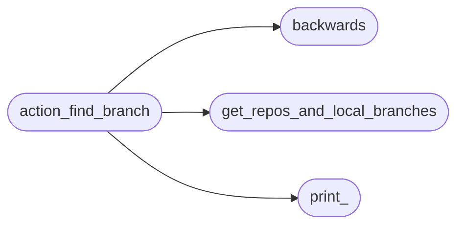
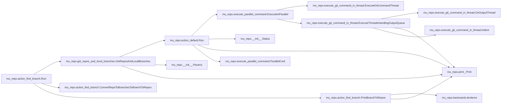
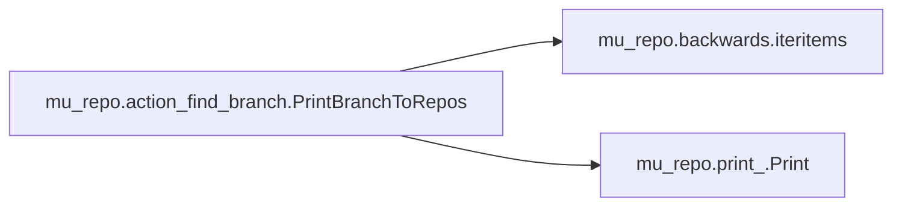

# Mu Repo Action Find Branch

[_Documentation generated by Documatic_](https://www.documatic.com)

<!---Documatic-section-Codebase Structure-start--->
## Codebase Structure

<!---Documatic-block-system_architecture-start--->

<!---Documatic-block-system_architecture-end--->

# #
<!---Documatic-section-Codebase Structure-end--->

<!---Documatic-section-mu_repo.action_find_branch.Run-start--->
## mu_repo.action_find_branch.Run

<!---Documatic-section-Run-start--->


### Object Calls

* mu_repo.get_repos_and_local_branches.GetReposAndLocalBranches
* mu_repo.action_find_branch.ConvertRepoToBranchesToBranchToRepos
* mu_repo.action_find_branch.PrintBranchToRepos

<!---Documatic-block-mu_repo.action_find_branch.Run-start--->
<details>
	<summary><code>mu_repo.action_find_branch.Run</code> code snippet</summary>

```python
def Run(params):
    args = params.args[1:]
    remote = False
    if len(args) > 0:
        if args[0] == '-r':
            del args[0]
            remote = True
    repos_and_local_branches = GetReposAndLocalBranches(params, patterns=['*%s*' % x for x in args], remote=remote)
    branch_to_repos = ConvertRepoToBranchesToBranchToRepos(repos_and_local_branches)
    PrintBranchToRepos(branch_to_repos, params)
```
</details>
<!---Documatic-block-mu_repo.action_find_branch.Run-end--->
<!---Documatic-section-Run-end--->

# #
<!---Documatic-section-mu_repo.action_find_branch.Run-end--->

<!---Documatic-section-mu_repo.action_find_branch.PrintBranchToRepos-start--->
## mu_repo.action_find_branch.PrintBranchToRepos

<!---Documatic-section-PrintBranchToRepos-start--->


### Object Calls

* mu_repo.backwards.iteritems
* mu_repo.print_.Print

<!---Documatic-block-mu_repo.action_find_branch.PrintBranchToRepos-start--->
<details>
	<summary><code>mu_repo.action_find_branch.PrintBranchToRepos</code> code snippet</summary>

```python
def PrintBranchToRepos(branch_to_repos, params):
    for (branch, repos) in sorted(iteritems(branch_to_repos)):
        if len(repos) == 1:
            msg = '${START_COLOR}%s${RESET_COLOR}' % (branch,)
        elif len(repos) == len(set(params.config.repos)):
            msg = '${START_COLOR}%s${RESET_COLOR}   (all repos)' % (branch,)
        else:
            msg = '${START_COLOR}%s${RESET_COLOR}   (%s)' % (branch, ', '.join(sorted(repos)))
        Print(msg)
```
</details>
<!---Documatic-block-mu_repo.action_find_branch.PrintBranchToRepos-end--->
<!---Documatic-section-PrintBranchToRepos-end--->

# #
<!---Documatic-section-mu_repo.action_find_branch.PrintBranchToRepos-end--->

<!---Documatic-section-mu_repo.action_find_branch.ConvertRepoToBranchesToBranchToRepos-start--->
## mu_repo.action_find_branch.ConvertRepoToBranchesToBranchToRepos

<!---Documatic-section-ConvertRepoToBranchesToBranchToRepos-start--->
<!---Documatic-block-mu_repo.action_find_branch.ConvertRepoToBranchesToBranchToRepos-start--->
<details>
	<summary><code>mu_repo.action_find_branch.ConvertRepoToBranchesToBranchToRepos</code> code snippet</summary>

```python
def ConvertRepoToBranchesToBranchToRepos(repos_and_local_branches):
    branch_to_repos = {}
    for (repo, branches) in repos_and_local_branches:
        for branch in branches:
            repos = branch_to_repos.get(branch)
            if repos is None:
                repos = branch_to_repos[branch] = set()
            repos.add(repo)
    return branch_to_repos
```
</details>
<!---Documatic-block-mu_repo.action_find_branch.ConvertRepoToBranchesToBranchToRepos-end--->
<!---Documatic-section-ConvertRepoToBranchesToBranchToRepos-end--->

# #
<!---Documatic-section-mu_repo.action_find_branch.ConvertRepoToBranchesToBranchToRepos-end--->

[_Documentation generated by Documatic_](https://www.documatic.com)