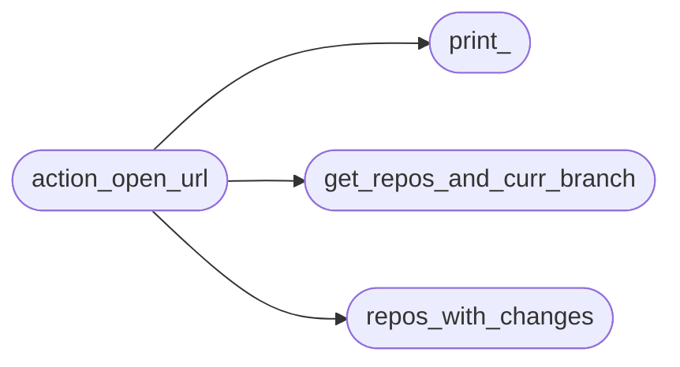

# Mu Repo Action Open Url

[_Documentation generated by Documatic_](https://www.documatic.com)

<!---Documatic-section-Codebase Structure-start--->
## Codebase Structure

<!---Documatic-block-system_architecture-start--->

<!---Documatic-block-system_architecture-end--->

# #
<!---Documatic-section-Codebase Structure-end--->

<!---Documatic-section-mu_repo.action_open_url.Run-start--->
## mu_repo.action_open_url.Run

```mermaid
flowchart LR
mu_repo.action_open_url.Run-->mu_repo.get_repos_and_curr_branch.GetReposAndCurrBranch
mu_repo.get_repos_and_curr_branch.GetReposAndCurrBranch-->mu_repo.action_default.Run
mu_repo.action_default.Run-->mu_repo.execute_parallel_command.ExecuteInParallel
mu_repo.execute_parallel_command.ExecuteInParallel-->mu_repo.execute_git_command_in_thread.ExecuteGitCommandThread
mu_repo.execute_parallel_command.ExecuteInParallel-->mu_repo.execute_git_command_in_thread.ExecuteThreadsHandlingOutputQueue
mu_repo.execute_git_command_in_thread.ExecuteThreadsHandlingOutputQueue-->mu_repo.execute_git_command_in_thread.OnOutputThread
mu_repo.execute_git_command_in_thread.ExecuteThreadsHandlingOutputQueue-->mu_repo.print_.Print
mu_repo.execute_git_command_in_thread.ExecuteThreadsHandlingOutputQueue-->mu_repo.execute_git_command_in_thread.Indent
mu_repo.action_default.Run-->mu_repo.__init__.Status
mu_repo.action_default.Run-->mu_repo.print_.Print
mu_repo.action_default.Run-->mu_repo.execute_parallel_command.ParallelCmd
mu_repo.get_repos_and_curr_branch.GetReposAndCurrBranch-->mu_repo.__init__.Params
mu_repo.get_repos_and_curr_branch.GetReposAndCurrBranch-->mu_repo.backwards.iteritems
mu_repo.get_repos_and_curr_branch.GetReposAndCurrBranch-->mu_repo.print_.Print
mu_repo.action_open_url.Run-->mu_repo.repos_with_changes.ComputeReposWithChangesFromCurrentBranchToOrigin
mu_repo.repos_with_changes.ComputeReposWithChangesFromCurrentBranchToOrigin-->mu_repo.execute_parallel_command.ExecuteInParallel
mu_repo.repos_with_changes.ComputeReposWithChangesFromCurrentBranchToOrigin-->mu_repo.execute_parallel_command.ParallelCmd
mu_repo.repos_with_changes.ComputeReposWithChangesFromCurrentBranchToOrigin-->mu_repo.action_diff.ParsePorcelain
mu_repo.action_diff.ParsePorcelain-->mu_repo.action_diff.StatusEntry
mu_repo.action_open_url.Run-->mu_repo.print_.Print
```

<!---Documatic-section-Run-start--->


### Object Calls

* mu_repo.get_repos_and_curr_branch.GetReposAndCurrBranch
* mu_repo.repos_with_changes.ComputeReposWithChangesFromCurrentBranchToOrigin
* mu_repo.print_.Print

<!---Documatic-block-mu_repo.action_open_url.Run-start--->
<details>
	<summary><code>mu_repo.action_open_url.Run</code> code snippet</summary>

```python
def Run(params):
    from mu_repo.get_repos_and_curr_branch import GetReposAndCurrBranch
    from mu_repo.repos_with_changes import ComputeReposWithChangesFromCurrentBranchToOrigin
    repos_and_curr_branch = GetReposAndCurrBranch(params)
    keywords = {}
    if len(params.args) < 2:
        Print('Not enough arguments passed.')
        return
    pattern = params.args[1]
    for arg in params.args[2:]:
        if arg.startswith('--'):
            i = arg.index('=')
            key = arg[2:i]
            val = arg[i + 1:]
            keywords[key] = val
        else:
            Print('Unexpected parameter: %s' % (arg,))
            return
    if pattern is None:
        Print('Main pattern not specified.')
        return
    if 'dest' not in keywords:
        Print('--dest= not specified')
        return
    dest = keywords['dest']
    repos_with_changes = set(ComputeReposWithChangesFromCurrentBranchToOrigin(repos_and_curr_branch, params, target_branch=dest))
    import webbrowser
    for (repo, branch) in repos_and_curr_branch:
        keywords['source'] = branch
        if repo in repos_with_changes:
            import os.path
            if repo == '.':
                repo = os.path.basename(os.path.realpath('.'))
            else:
                repo = repo.replace('.', '').replace('/', '').replace('\\', '')
            keywords['repo'] = repo
            url = pattern.format(**keywords)
            webbrowser.open_new_tab(url)
```
</details>
<!---Documatic-block-mu_repo.action_open_url.Run-end--->
<!---Documatic-section-Run-end--->

# #
<!---Documatic-section-mu_repo.action_open_url.Run-end--->

[_Documentation generated by Documatic_](https://www.documatic.com)