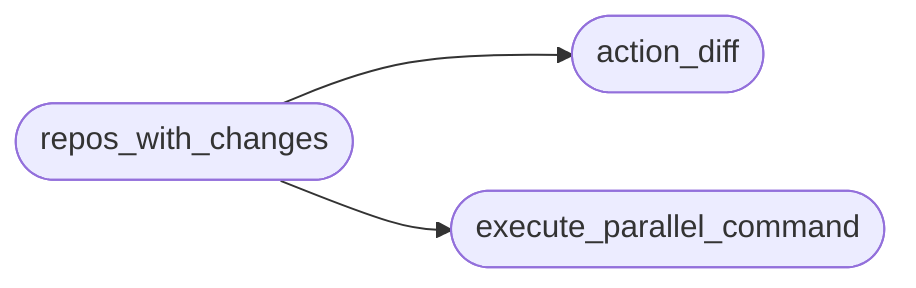
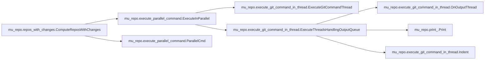
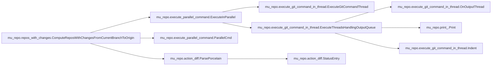

# Mu Repo Repos With Changes

[_Documentation generated by Documatic_](https://www.documatic.com)

<!---Documatic-section-Codebase Structure-start--->
## Codebase Structure

<!---Documatic-block-system_architecture-start--->

<!---Documatic-block-system_architecture-end--->

# #
<!---Documatic-section-Codebase Structure-end--->

<!---Documatic-section-mu_repo.repos_with_changes.ComputeReposWithChanges-start--->
## mu_repo.repos_with_changes.ComputeReposWithChanges

<!---Documatic-section-ComputeReposWithChanges-start--->


### Object Calls

* mu_repo.execute_parallel_command.ExecuteInParallel
* mu_repo.execute_parallel_command.ParallelCmd

<!---Documatic-block-mu_repo.repos_with_changes.ComputeReposWithChanges-start--->
<details>
	<summary><code>mu_repo.repos_with_changes.ComputeReposWithChanges</code> code snippet</summary>

```python
def ComputeReposWithChanges(repos_and_curr_branch, params):
    commands = []
    for (repo, _branch) in repos_and_curr_branch:
        commands.append(ParallelCmd(repo, [params.config.git] + ['status', '-s']))
    repos_with_changes = {}

    def OnOutput(output):
        if not output.stdout:
            repos_with_changes[output.repo] = False
        else:
            repos_with_changes[output.repo] = True
    ExecuteInParallel(commands, on_output=OnOutput)
    return repos_with_changes
```
</details>
<!---Documatic-block-mu_repo.repos_with_changes.ComputeReposWithChanges-end--->
<!---Documatic-section-ComputeReposWithChanges-end--->

# #
<!---Documatic-section-mu_repo.repos_with_changes.ComputeReposWithChanges-end--->

<!---Documatic-section-mu_repo.repos_with_changes.ComputeReposWithChangesFromCurrentBranchToOrigin-start--->
## mu_repo.repos_with_changes.ComputeReposWithChangesFromCurrentBranchToOrigin

<!---Documatic-section-ComputeReposWithChangesFromCurrentBranchToOrigin-start--->


### Object Calls

* mu_repo.execute_parallel_command.ExecuteInParallel
* mu_repo.execute_parallel_command.ParallelCmd
* mu_repo.action_diff.ParsePorcelain

<!---Documatic-block-mu_repo.repos_with_changes.ComputeReposWithChangesFromCurrentBranchToOrigin-start--->
<details>
	<summary><code>mu_repo.repos_with_changes.ComputeReposWithChangesFromCurrentBranchToOrigin</code> code snippet</summary>

```python
def ComputeReposWithChangesFromCurrentBranchToOrigin(repos_and_curr_branch, params, target_branch=None):
    commands = []
    for (repo, curr_branch) in repos_and_curr_branch:
        commands.append(ParallelCmd(repo, [params.config.git] + ('diff --name-only -z origin/%s' % (target_branch or curr_branch,)).split()))
    repos_with_changes = []

    def OnOutput(output):
        for _entry in ParsePorcelain(output.stdout, only_split=True):
            repos_with_changes.append(output.repo)
            break
    ExecuteInParallel(commands, on_output=OnOutput)
    return repos_with_changes
```
</details>
<!---Documatic-block-mu_repo.repos_with_changes.ComputeReposWithChangesFromCurrentBranchToOrigin-end--->
<!---Documatic-section-ComputeReposWithChangesFromCurrentBranchToOrigin-end--->

# #
<!---Documatic-section-mu_repo.repos_with_changes.ComputeReposWithChangesFromCurrentBranchToOrigin-end--->

[_Documentation generated by Documatic_](https://www.documatic.com)