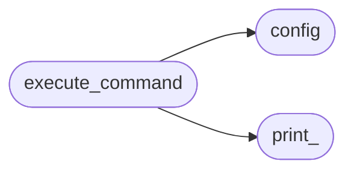
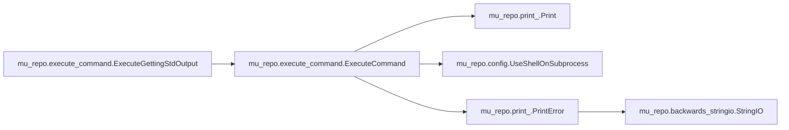
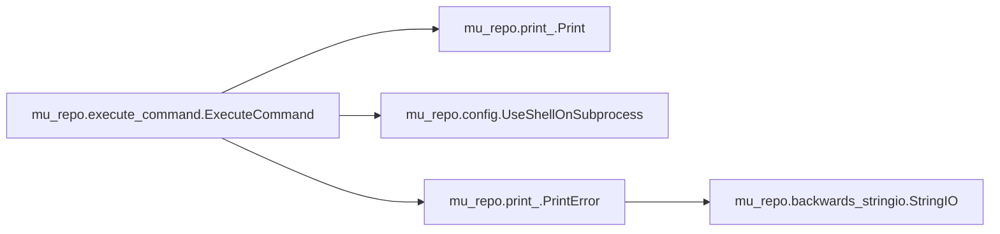

# Mu Repo Execute Command

[_Documentation generated by Documatic_](https://www.documatic.com)

<!---Documatic-section-Codebase Structure-start--->
## Codebase Structure

<!---Documatic-block-system_architecture-start--->

<!---Documatic-block-system_architecture-end--->

# #
<!---Documatic-section-Codebase Structure-end--->

<!---Documatic-section-mu_repo.execute_command.ExecuteGettingStdOutput-start--->
## mu_repo.execute_command.ExecuteGettingStdOutput

<!---Documatic-section-ExecuteGettingStdOutput-start--->


### Object Calls

* mu_repo.execute_command.ExecuteCommand

<!---Documatic-block-mu_repo.execute_command.ExecuteGettingStdOutput-start--->
<details>
	<summary><code>mu_repo.execute_command.ExecuteGettingStdOutput</code> code snippet</summary>

```python
def ExecuteGettingStdOutput(cmd, cwd):
    return ExecuteCommand(cmd, cwd, return_stdout=True, verbose=False)
```
</details>
<!---Documatic-block-mu_repo.execute_command.ExecuteGettingStdOutput-end--->
<!---Documatic-section-ExecuteGettingStdOutput-end--->

# #
<!---Documatic-section-mu_repo.execute_command.ExecuteGettingStdOutput-end--->

<!---Documatic-section-mu_repo.execute_command.ExecuteCommand-start--->
## mu_repo.execute_command.ExecuteCommand

<!---Documatic-section-ExecuteCommand-start--->


### Object Calls

* mu_repo.print_.Print
* mu_repo.config.UseShellOnSubprocess
* mu_repo.print_.PrintError

<!---Documatic-block-mu_repo.execute_command.ExecuteCommand-start--->
<details>
	<summary><code>mu_repo.execute_command.ExecuteCommand</code> code snippet</summary>

```python
def ExecuteCommand(cmd, repo, return_stdout=False, verbose=True):
    if verbose:
        msg = ' '.join([START_COLOR, '\n', repo, ':'] + cmd + [RESET_COLOR])
        Print(msg)
    try:
        shell = UseShellOnSubprocess()
        if return_stdout:
            p = subprocess.Popen(cmd, cwd=repo, stdout=subprocess.PIPE, shell=shell)
        else:
            p = subprocess.Popen(cmd, cwd=repo, shell=shell)
    except:
        PrintError('Error executing: ' + ' '.join(cmd) + ' on: ' + repo)
        raise
    if not return_stdout:
        p.wait()
    else:
        (stdout, _stderr) = p.communicate()
        return stdout
```
</details>
<!---Documatic-block-mu_repo.execute_command.ExecuteCommand-end--->
<!---Documatic-section-ExecuteCommand-end--->

# #
<!---Documatic-section-mu_repo.execute_command.ExecuteCommand-end--->

[_Documentation generated by Documatic_](https://www.documatic.com)