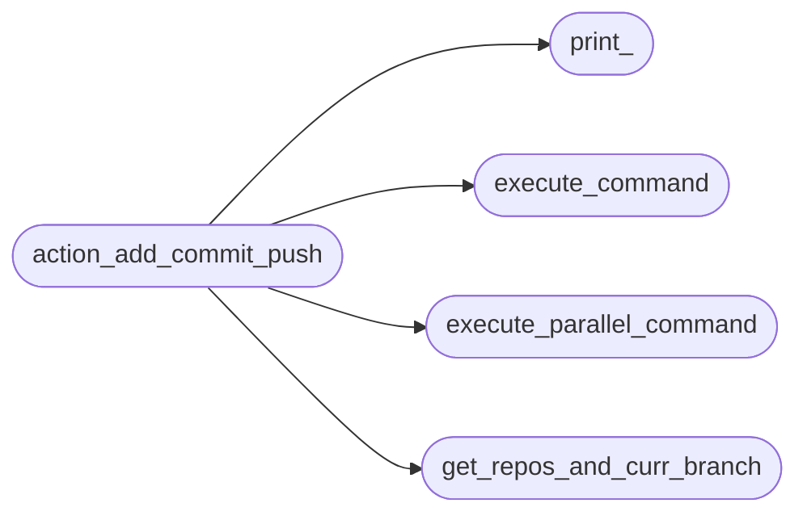
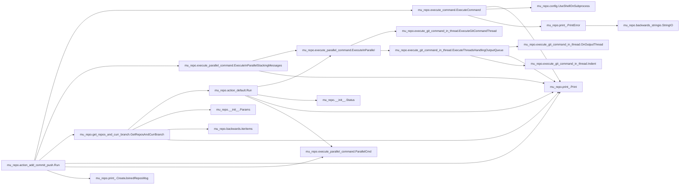

# Mu Repo Action Add Commit Push

[_Documentation generated by Documatic_](https://www.documatic.com)

<!---Documatic-section-Codebase Structure-start--->
## Codebase Structure

<!---Documatic-block-system_architecture-start--->

<!---Documatic-block-system_architecture-end--->

# #
<!---Documatic-section-Codebase Structure-end--->

<!---Documatic-section-mu_repo.action_add_commit_push.Run-start--->
## mu_repo.action_add_commit_push.Run

<!---Documatic-section-Run-start--->


### Object Calls

* mu_repo.execute_command.ExecuteCommand
* mu_repo.execute_parallel_command.ExecuteInParallelStackingMessages
* mu_repo.get_repos_and_curr_branch.GetReposAndCurrBranch
* mu_repo.print_.Print
* mu_repo.execute_parallel_command.ParallelCmd
* mu_repo.print_.CreateJoinedReposMsg

<!---Documatic-block-mu_repo.action_add_commit_push.Run-start--->
<details>
	<summary><code>mu_repo.action_add_commit_push.Run</code> code snippet</summary>

```python
def Run(params, add, commit, push):
    from .print_ import Print, CreateJoinedReposMsg
    args = params.args[1:]
    if push:
        force_push = False
        for force_flag in ('--force', '-f'):
            if force_flag in args:
                args.remove(force_flag)
                force_push = True
    if commit and (not args):
        git = params.config.git
        from mu_repo.execute_command import ExecuteCommand
        output = ExecuteCommand([git] + 'config --get-regexp editor'.split(), '.', return_stdout=True)
        editors = []
        for line in output.splitlines():
            if line.startswith(b'core.editor '):
                line = line[len(b'core.editor '):]
                editors.append(line)
        if not editors:
            Print('Message for commit is required for git add -A & git commit -m command (or git core.editor must be configured).')
            return
        else:
            import tempfile
            import subprocess
            with tempfile.NamedTemporaryFile(delete=False, suffix='.txt') as f:
                f.write(b'\n\n')
                f.write(b'# Please enter the commit message for your changes. Lines starting\n')
                f.write(b'# with "#" will be ignored, and an empty message aborts the commit.\n')
            import sys
            args = editors[0].decode(sys.getfilesystemencoding())
            if sys.platform == 'win32':
                args = args.replace(u"'", u'"')
            args += u' '
            filename = f.name
            if isinstance(filename, bytes):
                filename = filename.decode(sys.getfilesystemencoding())
            args += filename
            if hasattr(subprocess, 'run'):
                subprocess.run(args)
            else:
                subprocess.call(args)
            with open(f.name, 'r') as stream:
                lines = [x for x in stream.read().strip().splitlines() if not x.startswith('#')]
            contents = '\n'.join(lines)
            import os
            os.remove(f.name)
            if not contents:
                Print('Commit message not provided. Commit aborted.')
                return
            else:
                args = [contents]
    from .execute_parallel_command import ParallelCmd, ExecuteInParallelStackingMessages
    serial = params.config.serial
    if add:
        commands = [ParallelCmd(repo, [params.config.git, 'add', '-A']) for repo in params.config.repos]
        ExecuteInParallelStackingMessages(commands, lambda output: not output.stdout.strip(), lambda repos: Print(CreateJoinedReposMsg('Executed "git add -A" in:', repos)), serial=serial)
    if commit:
        commit_msg = ' '.join(args)
        commands = [ParallelCmd(repo, [params.config.git, 'commit', '-m', commit_msg]) for repo in params.config.repos]
        ExecuteInParallelStackingMessages(commands, lambda output: 'nothing to commit (working directory clean)' in output.stdout, lambda repos: Print(CreateJoinedReposMsg('Nothing to commit at:', repos)), serial=serial)
    if push:
        from .get_repos_and_curr_branch import GetReposAndCurrBranch
        repos_and_curr_branch = GetReposAndCurrBranch(params)
        if force_push:
            force_args = ['--force']
        else:
            force_args = []
        commands = [ParallelCmd(repo, [params.config.git, 'push', 'origin', branch] + force_args) for (repo, branch) in repos_and_curr_branch]
        ExecuteInParallelStackingMessages(commands, lambda output: not output.stdout.strip() and output.stderr.strip() == 'Everything up-to-date', lambda repos: Print(CreateJoinedReposMsg('Up-to-date:', repos)), serial=serial)
```
</details>
<!---Documatic-block-mu_repo.action_add_commit_push.Run-end--->
<!---Documatic-section-Run-end--->

# #
<!---Documatic-section-mu_repo.action_add_commit_push.Run-end--->

[_Documentation generated by Documatic_](https://www.documatic.com)