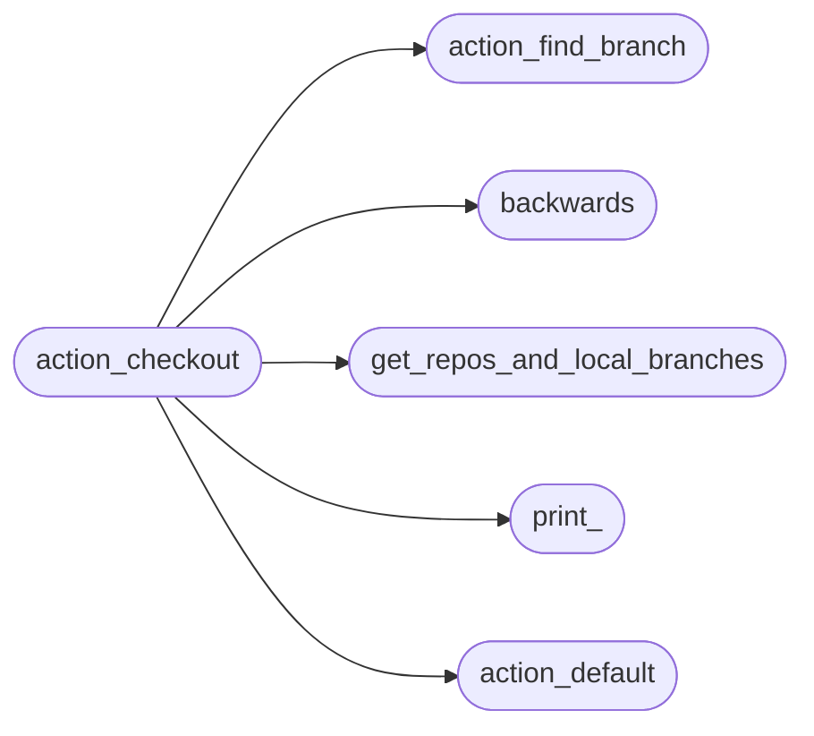
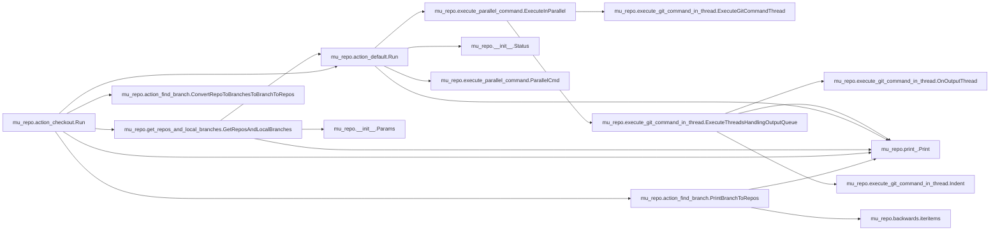

# Mu Repo Action Checkout

[_Documentation generated by Documatic_](https://www.documatic.com)

<!---Documatic-section-Codebase Structure-start--->
## Codebase Structure

<!---Documatic-block-system_architecture-start--->

<!---Documatic-block-system_architecture-end--->

# #
<!---Documatic-section-Codebase Structure-end--->

<!---Documatic-section-mu_repo.action_checkout.Run-start--->
## mu_repo.action_checkout.Run

<!---Documatic-section-Run-start--->


### Object Calls

* mu_repo.get_repos_and_local_branches.GetReposAndLocalBranches
* mu_repo.action_find_branch.ConvertRepoToBranchesToBranchToRepos
* mu_repo.print_.Print
* mu_repo.action_find_branch.PrintBranchToRepos
* mu_repo.action_default.Run

<!---Documatic-block-mu_repo.action_checkout.Run-start--->
<details>
	<summary><code>mu_repo.action_checkout.Run</code> code snippet</summary>

```python
def Run(params):
    base_branch = params.args[1]
    repos_and_local_branches = GetReposAndLocalBranches(params, patterns=['*%s*' % base_branch])
    branch_to_repos = ConvertRepoToBranchesToBranchToRepos(repos_and_local_branches)
    if len(params.config.repos) == 1:
        params.config.serial = True
    if base_branch in branch_to_repos or not branch_to_repos:
        from .action_default import Run
        return Run(params)
    if len(branch_to_repos) == 1:
        (branch, _repo) = list(branch_to_repos.items()).pop()
        params.args[1] = branch
        from .action_default import Run
        return Run(params)
    Print('Found more than one branch that matches ${START_COLOR}%s${RESET_COLOR}:\n' % params.args[1])
    PrintBranchToRepos(branch_to_repos, params)
    Print('\n${START_COLOR}ERROR${RESET_COLOR}: unable to decide branch to work on.', __color__='RED')
```
</details>
<!---Documatic-block-mu_repo.action_checkout.Run-end--->
<!---Documatic-section-Run-end--->

# #
<!---Documatic-section-mu_repo.action_checkout.Run-end--->

[_Documentation generated by Documatic_](https://www.documatic.com)