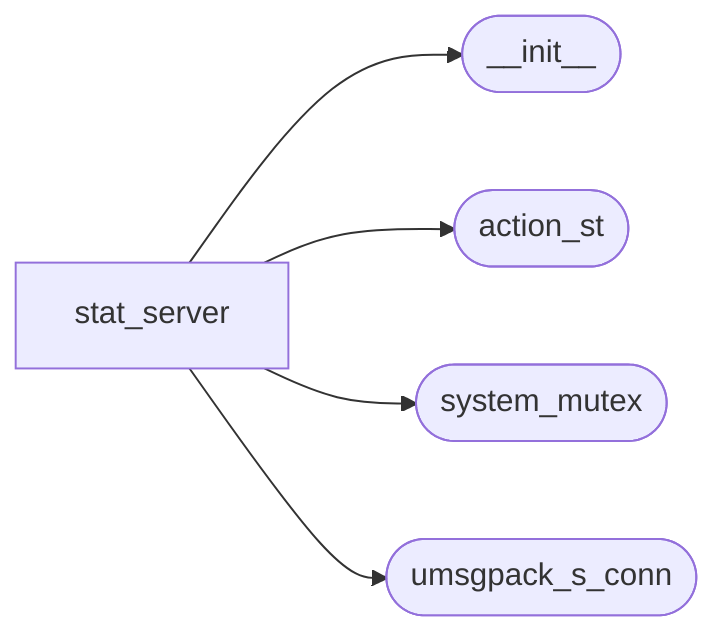
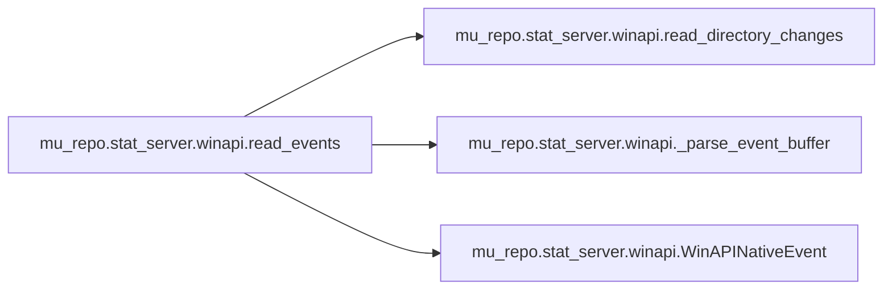

# Mu Repo Stat Server

[_Documentation generated by Documatic_](https://www.documatic.com)

<!---Documatic-section-Codebase Structure-start--->
## Codebase Structure

<!---Documatic-block-system_architecture-start--->

<!---Documatic-block-system_architecture-end--->

# #
<!---Documatic-section-Codebase Structure-end--->

<!---Documatic-section-mu_repo.stat_server.winapi.read_events-start--->
## mu_repo.stat_server.winapi.read_events

<!---Documatic-section-read_events-start--->


### Object Calls

* mu_repo.stat_server.winapi.read_directory_changes
* mu_repo.stat_server.winapi._parse_event_buffer
* mu_repo.stat_server.winapi.WinAPINativeEvent

<!---Documatic-block-mu_repo.stat_server.winapi.read_events-start--->
<details>
	<summary><code>mu_repo.stat_server.winapi.read_events</code> code snippet</summary>

```python
def read_events(handle, recursive):
    (buf, nbytes) = read_directory_changes(handle, recursive)
    events = _parse_event_buffer(buf, nbytes)
    return [WinAPINativeEvent(action, path) for (action, path) in events]
```
</details>
<!---Documatic-block-mu_repo.stat_server.winapi.read_events-end--->
<!---Documatic-section-read_events-end--->

# #
<!---Documatic-section-mu_repo.stat_server.winapi.read_events-end--->

<!---Documatic-section-mu_repo.stat_server.winapi.get_directory_handle-start--->
## mu_repo.stat_server.winapi.get_directory_handle

<!---Documatic-section-get_directory_handle-start--->
<!---Documatic-block-mu_repo.stat_server.winapi.get_directory_handle-start--->
<details>
	<summary><code>mu_repo.stat_server.winapi.get_directory_handle</code> code snippet</summary>

```python
def get_directory_handle(path):
    return CreateFileW(path, FILE_LIST_DIRECTORY, WATCHDOG_FILE_SHARE_FLAGS, None, OPEN_EXISTING, WATCHDOG_FILE_FLAGS, None)
```
</details>
<!---Documatic-block-mu_repo.stat_server.winapi.get_directory_handle-end--->
<!---Documatic-section-get_directory_handle-end--->

# #
<!---Documatic-section-mu_repo.stat_server.winapi.get_directory_handle-end--->

<!---Documatic-section-mu_repo.stat_server.winapi.WinAPINativeEvent-start--->
## mu_repo.stat_server.winapi.WinAPINativeEvent

<!---Documatic-section-WinAPINativeEvent-start--->
<!---Documatic-block-mu_repo.stat_server.winapi.WinAPINativeEvent-start--->
<details>
	<summary><code>mu_repo.stat_server.winapi.WinAPINativeEvent</code> code snippet</summary>

```python
class WinAPINativeEvent(object):

    def __init__(self, action, src_path):
        self.action = action
        self.src_path = src_path

    @property
    def is_added(self):
        return self.action == FILE_ACTION_CREATED

    @property
    def is_removed(self):
        return self.action == FILE_ACTION_REMOVED

    @property
    def is_modified(self):
        return self.action == FILE_ACTION_MODIFIED

    @property
    def is_renamed_old(self):
        return self.action == FILE_ACTION_RENAMED_OLD_NAME

    @property
    def is_renamed_new(self):
        return self.action == FILE_ACTION_RENAMED_NEW_NAME

    def __repr__(self):
        return '<WinAPINativeEvent: action=%d, src_path=%r>' % (self.action, self.src_path)
```
</details>
<!---Documatic-block-mu_repo.stat_server.winapi.WinAPINativeEvent-end--->
<!---Documatic-section-WinAPINativeEvent-end--->

# #
<!---Documatic-section-mu_repo.stat_server.winapi.WinAPINativeEvent-end--->

<!---Documatic-section-mu_repo.stat_server.winapi.read_directory_changes-start--->
## mu_repo.stat_server.winapi.read_directory_changes

<!---Documatic-section-read_directory_changes-start--->
<!---Documatic-block-mu_repo.stat_server.winapi.read_directory_changes-start--->
<details>
	<summary><code>mu_repo.stat_server.winapi.read_directory_changes</code> code snippet</summary>

```python
def read_directory_changes(handle, recursive):
    event_buffer = ctypes.create_string_buffer(BUFFER_SIZE)
    nbytes = ctypes.wintypes.DWORD()
    try:
        ReadDirectoryChangesW(handle, ctypes.byref(event_buffer), len(event_buffer), recursive, WATCHDOG_FILE_NOTIFY_FLAGS, ctypes.byref(nbytes), None, None)
    except WindowsError as e:
        if e.winerror == ERROR_OPERATION_ABORTED:
            return ([], 0)
        raise e
    try:
        int_class = long
    except NameError:
        int_class = int
    return (event_buffer.raw, int_class(nbytes.value))
```
</details>
<!---Documatic-block-mu_repo.stat_server.winapi.read_directory_changes-end--->
<!---Documatic-section-read_directory_changes-end--->

# #
<!---Documatic-section-mu_repo.stat_server.winapi.read_directory_changes-end--->

<!---Documatic-section-mu_repo.stat_server.winapi._parse_event_buffer-start--->
## mu_repo.stat_server.winapi._parse_event_buffer

<!---Documatic-section-_parse_event_buffer-start--->
<!---Documatic-block-mu_repo.stat_server.winapi._parse_event_buffer-start--->
<details>
	<summary><code>mu_repo.stat_server.winapi._parse_event_buffer</code> code snippet</summary>

```python
def _parse_event_buffer(readBuffer, nBytes):
    results = []
    while nBytes > 0:
        fni = ctypes.cast(readBuffer, LPFNI)[0]
        ptr = ctypes.addressof(fni) + FILE_NOTIFY_INFORMATION.FileName.offset
        filename = ctypes.string_at(ptr, fni.FileNameLength)
        results.append((fni.Action, filename.decode('utf-16')))
        numToSkip = fni.NextEntryOffset
        if numToSkip <= 0:
            break
        readBuffer = readBuffer[numToSkip:]
        nBytes -= numToSkip
    return results
```
</details>
<!---Documatic-block-mu_repo.stat_server.winapi._parse_event_buffer-end--->
<!---Documatic-section-_parse_event_buffer-end--->

# #
<!---Documatic-section-mu_repo.stat_server.winapi._parse_event_buffer-end--->

[_Documentation generated by Documatic_](https://www.documatic.com)