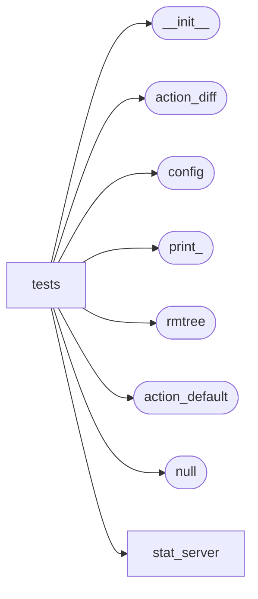

# Mu Repo Tests

[_Documentation generated by Documatic_](https://www.documatic.com)

<!---Documatic-section-Codebase Structure-start--->
## Codebase Structure

<!---Documatic-block-system_architecture-start--->

<!---Documatic-block-system_architecture-end--->

# #
<!---Documatic-section-Codebase Structure-end--->

<!---Documatic-section-mu_repo.tests.utils.configure_git_user-start--->
## mu_repo.tests.utils.configure_git_user

<!---Documatic-section-configure_git_user-start--->
<!---Documatic-block-mu_repo.tests.utils.configure_git_user-start--->
<details>
	<summary><code>mu_repo.tests.utils.configure_git_user</code> code snippet</summary>

```python
def configure_git_user(cwd='.'):
    subprocess.check_call('git config user.email testing@test.org', cwd=cwd, shell=True)
    subprocess.check_call('git config user.name Testing', cwd=cwd, shell=True)
```
</details>
<!---Documatic-block-mu_repo.tests.utils.configure_git_user-end--->
<!---Documatic-section-configure_git_user-end--->

# #
<!---Documatic-section-mu_repo.tests.utils.configure_git_user-end--->

<!---Documatic-section-mu_repo.tests.utils.push_dir-start--->
## mu_repo.tests.utils.push_dir

<!---Documatic-section-push_dir-start--->
<!---Documatic-block-mu_repo.tests.utils.push_dir-start--->
<details>
	<summary><code>mu_repo.tests.utils.push_dir</code> code snippet</summary>

```python
@contextmanager
def push_dir(directory):
    old = os.path.realpath(os.path.abspath(os.getcwd()))
    new_dir = os.path.realpath(os.path.abspath(directory))
    assert os.path.exists(new_dir)
    os.chdir(new_dir)
    try:
        yield
    finally:
        os.chdir(old)
```
</details>
<!---Documatic-block-mu_repo.tests.utils.push_dir-end--->
<!---Documatic-section-push_dir-end--->

# #
<!---Documatic-section-mu_repo.tests.utils.push_dir-end--->

[_Documentation generated by Documatic_](https://www.documatic.com)