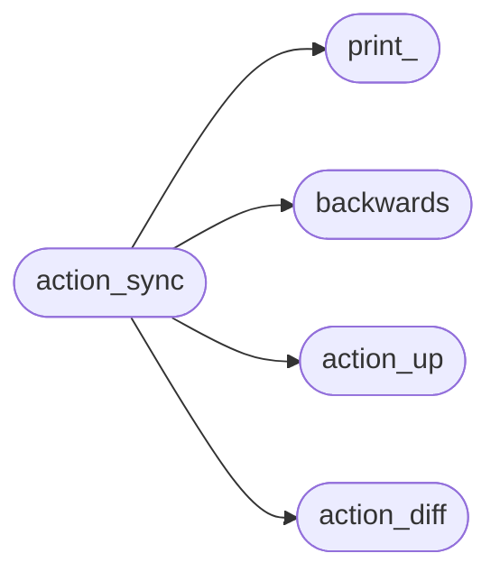
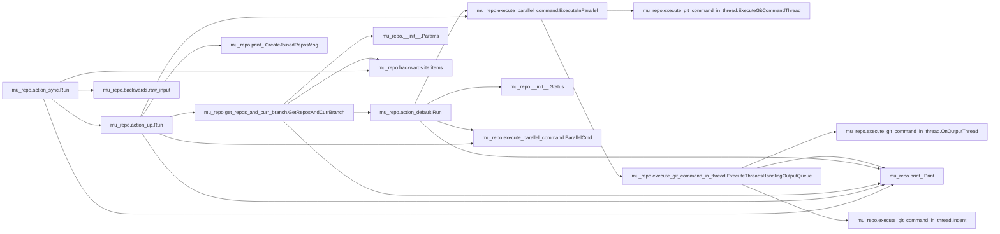

# Mu Repo Action Sync

[_Documentation generated by Documatic_](https://www.documatic.com)

<!---Documatic-section-Codebase Structure-start--->
## Codebase Structure

<!---Documatic-block-system_architecture-start--->

<!---Documatic-block-system_architecture-end--->

# #
<!---Documatic-section-Codebase Structure-end--->

<!---Documatic-section-mu_repo.action_sync.Run-start--->
## mu_repo.action_sync.Run

<!---Documatic-section-Run-start--->


### Object Calls

* mu_repo.action_up.Run
* mu_repo.backwards.iteritems
* mu_repo.print_.Print
* mu_repo.backwards.raw_input

<!---Documatic-block-mu_repo.action_sync.Run-start--->
<details>
	<summary><code>mu_repo.action_sync.Run</code> code snippet</summary>

```python
def Run(params):
    from .action_up import Run
    repos_and_curr_branch = Run(params)
    if not repos_and_curr_branch:
        Print('No tracked repos!')
        return
    branch_to_repos = {}
    for (repo, branch) in repos_and_curr_branch:
        curr = branch_to_repos.setdefault(branch, [])
        curr.append(repo)
    if len(branch_to_repos) > 1:
        msg = '\n${START_COLOR}Warning: found repos in different branches${RESET_COLOR}:\n  %s\nProceed?(y/n)' % '\n  '.join([str('Branch: ${START_COLOR}%s${RESET_COLOR} (%s)' % (key, ', '.join(val))) for (key, val) in branch_to_repos.items()])
        ret = ''
        while ret not in ('y', 'n'):
            Print(msg)
            ret = raw_input().strip().lower()
        if ret != 'y':
            return
    from .action_diff import Run
    initial_args = params.args[:]
    initial_repos = params.config.repos[:]
    for (branch, repos) in iteritems(branch_to_repos):
        params.args = initial_args + ['origin/' + branch]
        params.config.repos = repos
        if len(branch_to_repos) > 1:
            Print('\nOutput for branch: ${START_COLOR}%s${RESET_COLOR} (%s)' % (branch, ', '.join(repos)))
        Run(params)
    params.args = initial_args
    params.config.repos = initial_repos
```
</details>
<!---Documatic-block-mu_repo.action_sync.Run-end--->
<!---Documatic-section-Run-end--->

# #
<!---Documatic-section-mu_repo.action_sync.Run-end--->

[_Documentation generated by Documatic_](https://www.documatic.com)