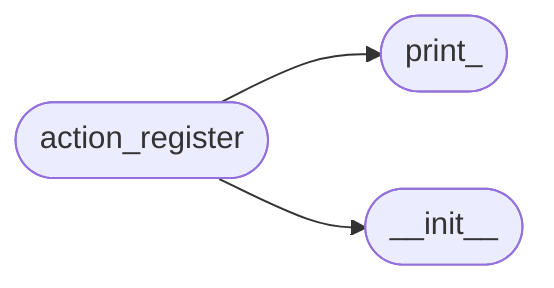
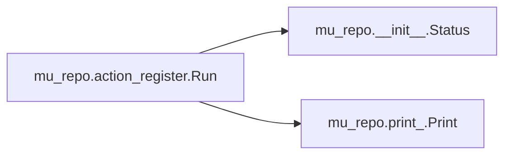

# Mu Repo Action Register

[_Documentation generated by Documatic_](https://www.documatic.com)

<!---Documatic-section-Codebase Structure-start--->
## Codebase Structure

<!---Documatic-block-system_architecture-start--->

<!---Documatic-block-system_architecture-end--->

# #
<!---Documatic-section-Codebase Structure-end--->

<!---Documatic-section-mu_repo.action_register.Run-start--->
## mu_repo.action_register.Run

<!---Documatic-section-Run-start--->


### Object Calls

* mu_repo.__init__.Status
* mu_repo.print_.Print

<!---Documatic-block-mu_repo.action_register.Run-start--->
<details>
	<summary><code>mu_repo.action_register.Run</code> code snippet</summary>

```python
def Run(params):
    args = params.args
    config_file = params.config_file
    config = params.config
    if len(args) < 2:
        msg = 'Repository (dir name|--all|--current|--recursive) to track not passed'
        Print(msg)
        return Status(msg, False)
    repos = config.repos
    msgs = []
    args = args[1:]
    join = os.path.join
    isdir = os.path.isdir
    if '--all' in args or '--current' in args or '--recursive' in args:
        if [arg for arg in args if not arg.startswith('--')]:
            Print('If an option is passed in mu register, no other dir names should be passed.')
            return
        if '--all' in args or '--current' in args:
            args = [repo for repo in os.listdir('.') if isdir(join(repo, '.git'))]
        elif '--recursive' in args:
            args = []
            search_paths = [os.path.realpath('.')]
            for (root, directories, filenames) in os.walk('.'):
                if '.git' in directories:
                    directories.remove('.git')
                for (idx, directory) in enumerate(directories):
                    if os.path.islink(join(root, directory)):
                        directory = os.path.realpath(join(root, directory))
                        if any(((directory + '/').startswith(search_path + '/') for search_path in search_paths)):
                            continue
                        directories[idx] = directory
                        search_paths.append(os.path.realpath(join(root, directory)))
                    if isdir(join(root, directory, '.git')):
                        args.append(os.path.relpath(join(root, directory)))
    new_args = []
    for arg in args:
        if arg.endswith('\\') or arg.endswith('/'):
            arg = arg[:-1]
        new_args.append(arg)
    args = new_args
    group_repos = config.groups.get(config.current_group, None)
    for repo in args:
        if repo in repos:
            msg = 'Repository: %s skipped, already registered' % (repo,)
        else:
            repos.append(repo)
            msg = 'Repository: %s registered' % (repo,)
        if group_repos is not None:
            if repo not in group_repos:
                group_repos.append(repo)
                msg += ' (added to group "%s")' % config.current_group
            else:
                msg += ' (already in group "%s")' % config.current_group
        Print(msg)
        msgs.append(msg)
    with open(config_file, 'w') as f:
        f.write(str(config))
    return Status('\n'.join(msgs), True, config)
```
</details>
<!---Documatic-block-mu_repo.action_register.Run-end--->
<!---Documatic-section-Run-end--->

# #
<!---Documatic-section-mu_repo.action_register.Run-end--->

[_Documentation generated by Documatic_](https://www.documatic.com)