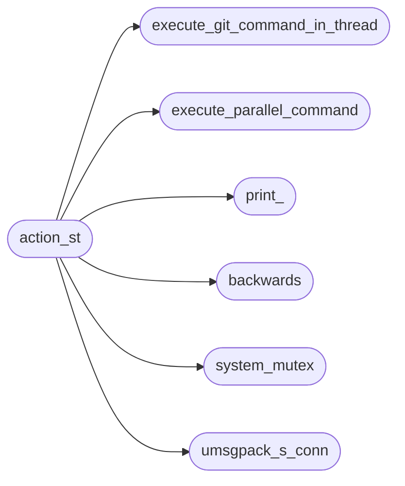
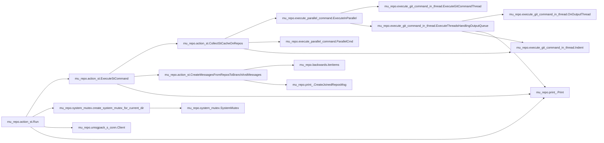
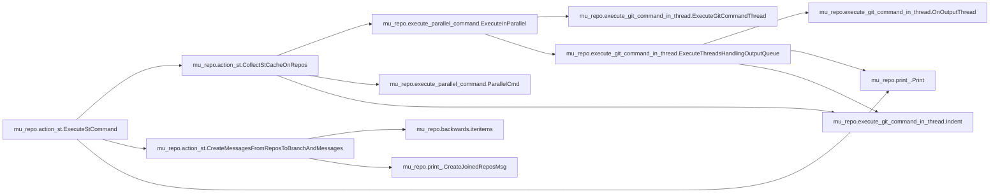

# Mu Repo Action St

[_Documentation generated by Documatic_](https://www.documatic.com)

<!---Documatic-section-Codebase Structure-start--->
## Codebase Structure

<!---Documatic-block-system_architecture-start--->

<!---Documatic-block-system_architecture-end--->

# #
<!---Documatic-section-Codebase Structure-end--->

<!---Documatic-section-mu_repo.action_st.Run-start--->
## mu_repo.action_st.Run

<!---Documatic-section-Run-start--->


### Object Calls

* mu_repo.action_st.ExecuteStCommand
* mu_repo.system_mutex.create_system_mutex_for_current_dir
* mu_repo.umsgpack_s_conn.Client
* mu_repo.print_.Print

<!---Documatic-block-mu_repo.action_st.Run-start--->
<details>
	<summary><code>mu_repo.action_st.Run</code> code snippet</summary>

```python
def Run(params):
    git = params.config.git
    repos = params.config.repos
    import sys
    if sys.platform == 'win32':
        from mu_repo.system_mutex import create_system_mutex_for_current_dir
        system_mutex = create_system_mutex_for_current_dir()
        if not system_mutex.get_mutex_aquired():
            with open(system_mutex.filename, 'r') as stream:
                port = int(stream.read().strip())
            from mu_repo.umsgpack_s_conn import ConnectionHandler, UMsgPacker, Client
            import threading
            event = threading.Event()

            class ClientHandler(ConnectionHandler, UMsgPacker):

                def _handle_decoded(self, msgs):
                    if not isinstance(msgs, (tuple, list)):
                        msgs = [msgs]
                    from mu_repo.print_ import Print
                    for msg in msgs:
                        Print(msg)
                    event.set()
            client = Client('127.0.0.1', port, ClientHandler)
            client.send(('stat', git, repos))
            event.wait(5)
            return
    ExecuteStCommand(params, repos, git)
```
</details>
<!---Documatic-block-mu_repo.action_st.Run-end--->
<!---Documatic-section-Run-end--->

# #
<!---Documatic-section-mu_repo.action_st.Run-end--->

<!---Documatic-section-mu_repo.action_st.ExecuteStCommand-start--->
## mu_repo.action_st.ExecuteStCommand

<!---Documatic-section-ExecuteStCommand-start--->


### Object Calls

* mu_repo.action_st.CollectStCacheOnRepos
* mu_repo.action_st.CreateMessagesFromReposToBranchAndMessages
* mu_repo.print_.Print

<!---Documatic-block-mu_repo.action_st.ExecuteStCommand-start--->
<details>
	<summary><code>mu_repo.action_st.ExecuteStCommand</code> code snippet</summary>

```python
def ExecuteStCommand(params, repos, git):
    from mu_repo.print_ import Print
    repos_to_branch_and_messages = CollectStCacheOnRepos(params, repos, git)
    for message in CreateMessagesFromReposToBranchAndMessages(repos, repos_to_branch_and_messages):
        Print(message)
```
</details>
<!---Documatic-block-mu_repo.action_st.ExecuteStCommand-end--->
<!---Documatic-section-ExecuteStCommand-end--->

# #
<!---Documatic-section-mu_repo.action_st.ExecuteStCommand-end--->

[_Documentation generated by Documatic_](https://www.documatic.com)