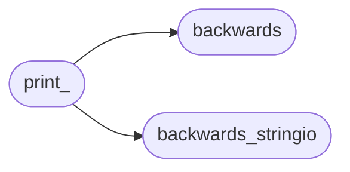

# Mu Repo Print

[_Documentation generated by Documatic_](https://www.documatic.com)

<!---Documatic-section-Codebase Structure-start--->
## Codebase Structure

<!---Documatic-block-system_architecture-start--->

<!---Documatic-block-system_architecture-end--->

# #
<!---Documatic-section-Codebase Structure-end--->

<!---Documatic-section-mu_repo.print_.Print-start--->
## mu_repo.print_.Print

<!---Documatic-section-Print-start--->
<!---Documatic-block-mu_repo.print_.Print-start--->
<details>
	<summary><code>mu_repo.print_.Print</code> code snippet</summary>

```python
def Print(*args, **kwargs):
    if _ignore_print:
        return
    color = kwargs.pop('__color__', 'CYAN')
    assert 'file' not in kwargs
    f = sys.stdout
    try:
        msg = ' '.join(args)
    except:
        msg = ' '.join((str(x) for x in args))
    i = msg.find(START_COLOR)
    while i >= 0:
        write_without_color = msg[:i]
        f.write(write_without_color)
        msg = msg[i + len(START_COLOR):]
        i = msg.find(RESET_COLOR)
        if i >= 0:
            write_in_colors = msg[:i]
            msg = msg[i + len(RESET_COLOR):]
        else:
            write_in_colors = msg
            msg = ''
        console.SetColor(color)
        try:
            f.write(write_in_colors)
        finally:
            console.Reset()
        i = msg.find(START_COLOR)
    f.write(msg + '\n')
```
</details>
<!---Documatic-block-mu_repo.print_.Print-end--->
<!---Documatic-section-Print-end--->

# #
<!---Documatic-section-mu_repo.print_.Print-end--->

<!---Documatic-section-mu_repo.print_.CreateJoinedReposMsg-start--->
## mu_repo.print_.CreateJoinedReposMsg

<!---Documatic-section-CreateJoinedReposMsg-start--->
<!---Documatic-block-mu_repo.print_.CreateJoinedReposMsg-start--->
<details>
	<summary><code>mu_repo.print_.CreateJoinedReposMsg</code> code snippet</summary>

```python
def CreateJoinedReposMsg(msg, repos):
    if msg.endswith(':'):
        msg += ' '
    if msg:
        msg = '${START_COLOR}%s${RESET_COLOR}' % (msg,)
    msg += ', '.join(sorted(repos))
    return msg
```
</details>
<!---Documatic-block-mu_repo.print_.CreateJoinedReposMsg-end--->
<!---Documatic-section-CreateJoinedReposMsg-end--->

# #
<!---Documatic-section-mu_repo.print_.CreateJoinedReposMsg-end--->

[_Documentation generated by Documatic_](https://www.documatic.com)