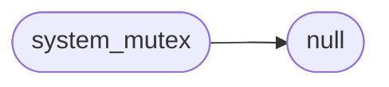
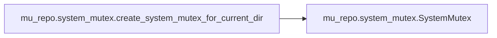

# Mu Repo System Mutex

[_Documentation generated by Documatic_](https://www.documatic.com)

<!---Documatic-section-Codebase Structure-start--->
## Codebase Structure

<!---Documatic-block-system_architecture-start--->

<!---Documatic-block-system_architecture-end--->

# #
<!---Documatic-section-Codebase Structure-end--->

<!---Documatic-section-mu_repo.system_mutex.create_system_mutex_for_current_dir-start--->
## mu_repo.system_mutex.create_system_mutex_for_current_dir

<!---Documatic-section-create_system_mutex_for_current_dir-start--->


### Object Calls

* mu_repo.system_mutex.SystemMutex

<!---Documatic-block-mu_repo.system_mutex.create_system_mutex_for_current_dir-start--->
<details>
	<summary><code>mu_repo.system_mutex.create_system_mutex_for_current_dir</code> code snippet</summary>

```python
def create_system_mutex_for_current_dir():
    import hashlib
    s = hashlib.sha1()
    s.update(os.path.normcase(os.path.normpath(os.path.abspath(os.curdir))).encode('utf-8'))
    return SystemMutex(s.hexdigest() + '.mu_repo_mutex')
```
</details>
<!---Documatic-block-mu_repo.system_mutex.create_system_mutex_for_current_dir-end--->
<!---Documatic-section-create_system_mutex_for_current_dir-end--->

# #
<!---Documatic-section-mu_repo.system_mutex.create_system_mutex_for_current_dir-end--->

<!---Documatic-section-mu_repo.system_mutex.SystemMutex-start--->
## mu_repo.system_mutex.SystemMutex

<!---Documatic-section-SystemMutex-start--->
<!---Documatic-block-mu_repo.system_mutex.SystemMutex-start--->
<details>
	<summary><code>mu_repo.system_mutex.SystemMutex</code> code snippet</summary>

```python
class SystemMutex(object):

    def __init__(self, mutex_name):
        check_valid_mutex_name(mutex_name)
        filename = self.filename = os.path.join(tempfile.gettempdir(), mutex_name)
        try:
            os.unlink(filename)
        except:
            pass
        try:
            handle = os.open(filename, os.O_CREAT | os.O_EXCL | os.O_RDWR)
            self.handle = handle
        except:
            self._release_mutex = NULL
            self._acquired = False
        else:

            def release_mutex(*args, **kwargs):
                if not getattr(release_mutex, 'called', False):
                    release_mutex.called = True
                    try:
                        os.close(handle)
                    except:
                        traceback.print_exc()
                    try:
                        os.unlink(filename)
                    except:
                        pass
            self._ref = weakref.ref(self, release_mutex)
            self._release_mutex = release_mutex
            self._acquired = True

    def write(self, s):
        os.write(self.handle, s)

    def get_mutex_aquired(self):
        return self._acquired

    def release_mutex(self):
        self._release_mutex()
```
</details>
<!---Documatic-block-mu_repo.system_mutex.SystemMutex-end--->
<!---Documatic-section-SystemMutex-end--->

# #
<!---Documatic-section-mu_repo.system_mutex.SystemMutex-end--->

[_Documentation generated by Documatic_](https://www.documatic.com)