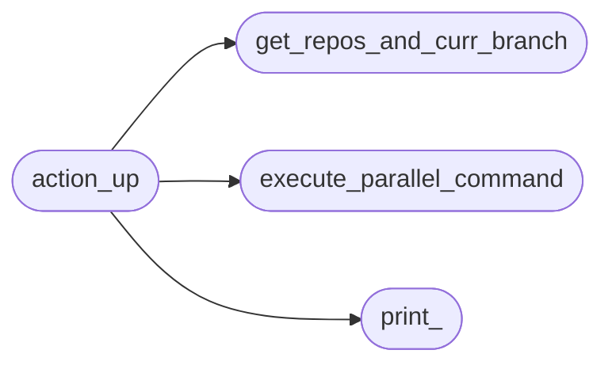
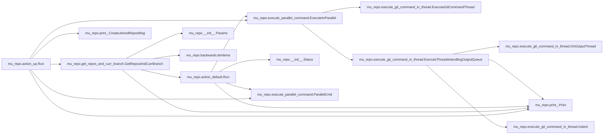

# Mu Repo Action Up

[_Documentation generated by Documatic_](https://www.documatic.com)

<!---Documatic-section-Codebase Structure-start--->
## Codebase Structure

<!---Documatic-block-system_architecture-start--->

<!---Documatic-block-system_architecture-end--->

# #
<!---Documatic-section-Codebase Structure-end--->

<!---Documatic-section-mu_repo.action_up.Run-start--->
## mu_repo.action_up.Run

<!---Documatic-section-Run-start--->


### Object Calls

* mu_repo.get_repos_and_curr_branch.GetReposAndCurrBranch
* mu_repo.execute_parallel_command.ExecuteInParallel
* mu_repo.print_.Print
* mu_repo.print_.CreateJoinedReposMsg
* mu_repo.execute_parallel_command.ParallelCmd

<!---Documatic-block-mu_repo.action_up.Run-start--->
<details>
	<summary><code>mu_repo.action_up.Run</code> code snippet</summary>

```python
def Run(params):
    repos_and_curr_branch = GetReposAndCurrBranch(params)
    commands = []
    if len(params.args) > 1 and params.args[1] in ('-a', '--all'):
        for (repo, branch) in repos_and_curr_branch:
            commands.append(ParallelCmd(repo, [params.config.git, 'fetch']))
    else:
        for (repo, branch) in repos_and_curr_branch:
            commands.append(ParallelCmd(repo, [params.config.git, 'fetch', 'origin', '%s:refs/remotes/origin/%s' % (branch, branch)]))
    repos = []

    def on_output(output):
        if not output.stdout.strip() and (not output.stderr.strip()):
            repos.append(output.repo)
        else:
            Print(output)
    ExecuteInParallel(commands, on_output=on_output)
    if repos:
        Print(CreateJoinedReposMsg('Repositories fetched with no changes:', repos))
    return repos_and_curr_branch
```
</details>
<!---Documatic-block-mu_repo.action_up.Run-end--->
<!---Documatic-section-Run-end--->

# #
<!---Documatic-section-mu_repo.action_up.Run-end--->

[_Documentation generated by Documatic_](https://www.documatic.com)